# The Neutron Detection Landscape (2026): Applications, Market Dynamics, and Emerging Opportunities

**Luke Philip, Samuel Angus, Parker LaTour, Cory Stephenson**

---

## Scope

Neutron detection is not a single market. Every application imposes different requirements and challenges on spatial resolution, temporal resolution, spectral distribution, geometric constraints, detector lifetime, and cost. Due to this, the neutron detector landscape is best understood through the lens of end-user applications rather than detector technologies alone.

Through the exploration of neutron detector applications, a deeper understanding of the market landscape will emerge, enabling the ability to identify gaps in the industry where novel detection technologies can provide value.

---

## Table of Contents

- [1) Why Neutron Detection Matters](#1-why-neutron-detection-matters)
  - [1.1 What Information Neutrons Provide](#11-what-information-neutrons-provide)
  - [1.2 Why Neutrons Are Difficult To Detect](#12-why-neutrons-are-difficult-to-detect)
  - [1.3 The Historical Detector Landscape](#13-the-historical-detector-landscape)
- [2) Market Applications & Requirements Framework](#2-market-applications--requirements-framework)
  - [2.1 Fusion Energy](#21-fusion-energy)
  - [2.2 Fission Reactors & SMRs](#22-fission-reactors--SMRs)
  - [2.3 Nuclear Safeguards & Special Nuclear Materials (SNM)](#23-nuclear-safeguards--special-nuclear-materials-snm)
  - [2.4 Industrial Imaging & Non-Destructive Testing (NDT)](#24-industrial-imaging--non-destructive-testing-ndt)
  - [2.5 Medical Therapy & Imaging](#25-medical-therapy--imaging)
  - [2.6 Oil & Gas](#26-oil--gas)
  - [2.7 Defense & Space](#27-defense--space)
- [3) Deep Dives Into Key Modern Markets](#3-deep-dives-into-key-modern-markets)
  - [3.1 Fusion Diagnostics](#31-fusion-diagnostics)
  - [3.2 Advanced Fission Reactor Diagnostics](#32-advanced-fission-reactor-diagnostics)
  - [3.3 Digital Neutron Imaging](#33-digital-neutron-imaging)
- [4) The Global Neutron Detection Ecosystem](#4-the-global-neutron-detection-ecosystem)
  - [4.1 Commercial Detector Manufacturers](#41-commercial-detector-manufacturers)
  - [4.2 Research Institutions Driving Detector Innovation](#42-research-institutions-driving-detector-innovation)
  - [4.3 Fusion Diagnostics Programs](#43-fusion-diagnostics-programs)
  - [4.4 Advanced Reactor Instrumentation](#44-advanced-reactor-instrumentation)
  - [4.5 Defense, Safeguards, and Nuclear Security](#45-defense-safeguards-and-nuclear-security)
  - [4.6 Scientific Neutron Facilities](#46-scientific-neutron-facilities)
  - [4.7 Government Investment and Strategic Direction](#47-government-investment-and-strategic-direction)
  - [4.8 Cross-Cutting Technology Trends](#48-cross-cutting-technology-trends)
  - [4.9 Remaining Technology Gaps](#49-remaining-technology-gaps)
  - [4.10 Why the Ecosystem Motivates Next-Generation Semiconductor Detectors](#410-why-the-ecosystem-motivates-next-generation-semiconductor-detectors)
- [5) Network Map](#5-network-map)
- [6) Resources & Notes](#6-resources--notes)

---

## 1) Why Neutron Detection Matters

The last decade has seen renewed investment focus on technologies that depend heavily on neutron measurements. Established fusion companies and startups are pursuing the development of commercial fusion energy, advanced reactor developers are reimagining nuclear power through small modular reactors (SMRs) and molten salt systems, governments continue to invest heavily in nuclear safeguards and homeland security efforts, and industries ranging from aerospace inspection to medicine are exploring novel methods to leverage neutron imaging and therapy. These fields have drastically different goals, yet they all share a common requirement. This is the ability to accurately detect, characterize, and distinguish neutrons.

> "Measuring neutrons accurately is critical for a variety of applications, including energy research, national security, scientific experiments, medicine and nuclear safeguards. But getting accurate neutron measurements is surprisingly hard." - [Los Alamos National Laboratory](https://www.lanl.gov/media/news/0330-neutron-detection-capabilities)

Neutrons are like all other forms of radiation in that their interaction probability, and therefore our ability to detect them, is determined quantum mechanically and requires specific materials and methods to achieve detection. What separates neutrons from everything else, and why sophisticated methods of detection are expense and slow to develop, is that they lack charge. Neutron detection is a mature field in regard to gas chambers and scintillators with their development going back to the 1930s. The difference in development between xray and neutron detection comes down to applications.

In fusion systems, neutrons reveal to engineers where the reactions are occurring, how frequently they are occurring, and what reaction pathways dominate within the confined plasma. In fission reactors, neutron populations provide direct insight into reactor criticality and the state of operations. In nuclear security, neutron emissions can reveal the presence of special nuclear materials (SNM), while in medicine, neutron measurements may play a vital part in making sure that radiation therapies are properly delivered safely and effectively to patients. In industrial imaging applications, neutron measurements allow operators to visualize objects that are impossible to analyze using solely x-rays. Across each of these applications, neutrons serve not merely as a byproduct of physical processes, but as a source of information.

> "These neutrons can tell us if fusion is occurring, how much, what types of fuels are reacting, and give insights into the performance of fusion machines" - [Helion](https://www.helionenergy.com/blog/measuring-fusion-reactions-neutron-diagnostics)

This idea that neutrons are information rather than merely radiation, is central to understanding the importance of neutron detection. Whether the goal is to analyze fusion plasma in a reactor, monitor reactor criticality, identify illicit special nuclear materials, or inspect aircraft components, the challenge is extracting useful information from neutron interactions.

A particularly insightful visible representation comes from Helion, where neutron interactions reveal themselves in a camera image:

> "You can work out how many neutrons we made in this D-T pulse based on this photo. 👀 The astute eye will see lost pixels in the image, the white specks. This is what happens when neutrons hit the camera while it’s capturing an image." - [Helion](https://x.com/Helion_Energy/status/2024172712588169723)

Even in a simple photograph, neutrons can leave significant traces that reveal information about the underlying physical process. In this image, neutron interactions with the camera sensor produced visible signatures that can be analyzed to draw conclusions about a fusion pulse. Neutrons constantly carry information about the systems that create them, however, detection is complicated due to the fact that they are are invisible to humans.

Thus, gathering that information is far from straightforward. Neutrons are electrically neutral and interact only weakly with matter, making them uniquely difficult to detect. The challenge of converting neutron interactions into reliable measurements has driven nearly a century of detector development and remains an active area of research today.

Different applications require fundamentally different information from neutron measurements. A detector that is specifically optimized for fusion diagnostics may perform poorly when it comes to nuclear safeguards, imaging, or medical applications. As a result, neutron detection has evolved into a collection of highly specialized technologies rather than a single universal solution.

For this reason, neutron detection is best understood through the lens of end-user applications rather than solely specific detector technologies. The question is not simply how to detect neutrons, but what information must be extracted from them, under what constraints, and all at what cost. Throughout this paper, examination of neutron detection is from the perspective of the various industries that depend on the technology. By understanding the key role that neutrons play across fusion energy, fission reactors, security and safeguards, imaging, medicine, and other growing markets, we can identify where the existing solutions succeed, where they fall short, and ultimately where new opportunities may emerge for the next generation of neutron detection systems.

---

### 1.1 What Information Neutrons Provide

Neutrons are crucial to many processes because they carry information about the underlying physical processes that produced them. Neutrons by nature are invisible and electrically neutral, however, their properties that are measurable allow researchers to make inferences about the conditions inside systems that are otherwise inaccessible. These measurable properties include quantity, energy, timing, direction, and spatial distribution. Neutrons act as signals of what is occurring inside systems, carrying information from regions where direct observation is not possible. 

```
+-------------+--------------------+------------------+-----------------------------+
| Measurement | Main applications  | What it informs  | Typical required attributes |
+-------------+--------------------+------------------+-----------------------------+
| Total count | Fusion, reactors,  | Fusion yield,    | Wide dynamic range, calibr- |
| / flux      | BNCT beam QA,      | reactor power &  | ation stability, high-rate  |
|             | portal monitoring  | subcriticality,  | capability                  |
|             |                    | beam output      |                             |
+-------------+--------------------+------------------+-----------------------------+
| Energy      | Fusion, BNCT,      | Reaction pathway,| Thermal-to-fast coverage,   |
| spectrum    | planet science,    | ion temperature, | practical spectral          |  
|             | crew dosimetry     | beam contam.,    | discrimination, gamma       |  
|             |                    | dose equivalent  | rejection                   |
+-------------+--------------------+------------------+-----------------------------+
| Direction   | Fusion source,     | Where reactions  | Collimation or imaging      |
| /           | localization,      | occur, if source | geometry, background        |
| emissivity  | planetary mapping  | localized, how H | suppression, sometimes      |
|             |                    | varies spatially | tomography                  |
+-------------+--------------------+------------------+-----------------------------+
| Correlation | Safeguards,        | Fissile mass,    | High efficiency, stable     |
| statistics  | security, active   | false-alarm      | coincidence logic, neutron  |
|             | interrogation      | reduction,       | / gamma discrimination      |
|             |                    | shielded SNM     |                             |
|             |                    | detection        |                             |
+-------------+--------------------+------------------+-----------------------------+
| Timing /    | Pulsed fusion,     | Burn evolution,  | Low dead time, microsecond- |
| time        | reactor startup    | reactor period,  | to-milisecond timing        |
| history     | safeguards,        | correlated       | depending on use case       |
|             | multiplicity       | fission          |                             |
+-------------+--------------------+------------------+-----------------------------+
| Spatial     | Industrial imaging,| Internal struct.,| Spatial resolution, field   |
| attenuation | batteries, fuel    | H/Li/H2O         | of view, acquisition speed, |
|             | cells, corrosion   | distribution,    | often operando capability   |
|             |                    | defects, phase   |                             |
|             |                    | changes          |                             |
+-------------+--------------------+------------------+-----------------------------+ 

```

_**Neutron count reveals reaction rate**_

The most fundamental piece of data that is generated from neutron detection is simply how many are being produced in an event. Neutron count rates are often directly related to the number of nuclear reactions that take place in a system. In fusion energy applications, neutron yield is one of the primary signals of fusion performance since each specific type of fusion reaction produces a predictable amount of neutrons. Similarly, reactor operators monitor neutron populations during events to assess the power of the reactor and to check that the system is operating within safe conditions.

Even in simple devices, neutron detectors have the ability to reveal whether nuclear reactions are occurring, how frequently they occur, and whether the conditions within the system are changing over time. In the industry, neutron counting is a fundamental and widely used measurement due to the direct relationship between neutron production and reaction rate.

_**Neutron energy reveals the underlying physics**_

Looking beyond neutron count, neutron energy often reveals insights into the underlying nuclear processes. Earlier it was stated that each fusion reaction type produces its own predictable amounts of neutrons. However, neutrons with characteristic energy distributions are also generated from these different types of nuclear reactions. For example, Deuterium-Tritium fusion (D-T) generates neutrons near 14.1 MeV. Deuterium-Deuterium fusion (D-D) creates neutrons with energy levels around 2.45 MeV. Therefore, measuring the energy levels of neutrons allows engineers to identify reaction pathways and determine which fuel sources are impacting performance the most. 

<p align="center" width="100%">
    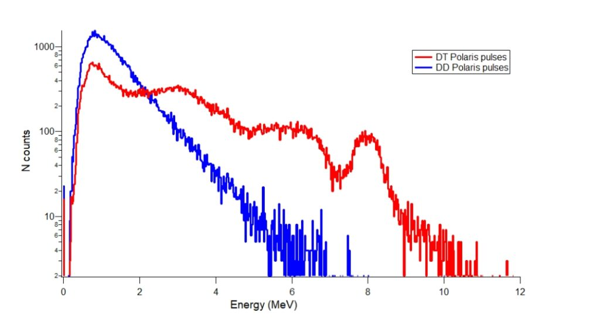
</p>
<p align="center"><em>Energy spectrum detected by Helion's diamond array. The blue and red spectra are characteristic of D-D and D-T neutron signals, and the red peaks gave them confidence that they achieved measurable amounts of D-T fusion.</em></p>

In addition, the energy measurements of the neutrons also serve as indicators of the environments through which they traveled, such as the material composition, geometry, and shielding characteristics. This is because when neutrons interact with the materials around them, they scatter and lose energy, creating a resulting energy spectrum that provides methods to analyze such information.

_**Timing reveals dynamic behavior**_

The time at which neutrons arrive during an observed event can provide information that is unavailable through neutron count rates alone. In a pulsed system for example, the timing of neutron appearance allows engineers to discern how reactions change and progress during microsecond or even nanosecond increments. Such precise information can become key when monitoring system instability and performance that is usually masked by an average during data collection.

Because the neutron's speed is related to its energy, time measurements for how long it takes to travel a known distance yields its energy with high precision. This is known as time-of-flight measurements. At inertial-confinement facilities, neutron time-of-flight detectors measure both yield and spectrum through this method. The same principle lets a single measurement in pulsed-source imaging understand which isotopes a beam passes through, since different atomic nuclei absorb different neutron energies.

_**Direction highlights source location**_

Additionally, neutrons contain critical spatial information. Analyzing the direction from which neutrons originate, engineers can pinpoint the location of regions that are neutron producing within a system. In fusion devices, this ability helps identify where reactions occur inside the plasma, proving to be crucial information helping to aid companies in the race towards commercial fusion. In security applications, directionality can identify SNMs in proximity and uncover hidden neutron sources.

Technology that can discriminate between neutron trajectories becomes crucial in systems where simultaneous sources of radiation or neutron emission may be present.

> **TAKEAWAY:** Neutron detectors produce far more information than simply revealing radiation presence. Neutron populations generate data about reaction rates, energy distributions, temporal behavior, and source location. Thus, the real advantage a neutron detector provides stems from its ability to extract the specific information for each unique application, rather than just its ability to detect neutron presence. Understanding these separate information channels provides the foundation for evaluating why different industries require drastically different detection technologies.

---

### 1.2 Why Neutrons Are Difficult To Detect

The value of neutron detection derives from the information that neutrons carry. However, extracting said information has proven to be a more complex task than traditional methods of radiation measurement. Unlike charged particles, neutrons do not produce ionization directly as they pass through matter. This trait that is characteristic of neutrons has driven nearly every neutron detector architecture developed over the past century and remains one of the primary reasons why neutron detection continues to present challenges to engineers across a variety of industries.

_**Neutrons do not ionize directly**_

Traditional radiation technologies rely on the standard principle that when a charged particle deposits energy into a material, ionization is created that can be measured as an electrical signal. This mechanism has driven the measurement technologies of alpha particles, beta particles, electrons, and many other heavy charged ions. Neutrons, on the other hand, carry no charge. As a result, they have the ability to pass through materials without presenting any signal or producing the direct ionization needed to detect them through traditional methods.

This differentiation between neutrons and charged particles is what separates neutron detection from many other problems in sensor engineering. A neutron detector cannot simply observe the neutron itself. Instead, it must indirectly observe it through evidence produced as a result of its interactions that may occur within the detector material. In practice, this means that neutron detection is an indirect measurement process. Thus, requiring additional physical mechanisms in place to account for the intrinsic constraints prior to useful information being extracted.

_**Detection requires conversion into charged particles**_

As neutrons do not directly ionize, most detector technologies convert neutrons into charged particles, typically via nuclear reactions with materials such as helium-3, boron-10, lithium-6, or hydrogen-rich compounds. 

Upon interaction with these materials within the device, the neutron induces a reaction that generates charged particles, which subsequently deposits energy in the detector medium. This energy deposition is then measurable by conventional electronics, capturing the signal from neutron interactions. Numerous detectors utilize this two-stage approach to address the detection challenge.

The conversion step introduces additional complexity to many detection methods. Inefficiencies, engineering trade-offs, and potential error sources emerge at each stage of the design process. As a result, the material selection, the detector's geometry, and the operating conditions all impact whether a neutron interaction serves as a useful measurement.

_**Interaction probabilities are small and energy-dependent**_

Another challenge arises from the probabilistic nature of neutron interactions. When a detector is exposed to a neutron source, the probability of the device sensing its presence is not guaranteed. In many cases, neutrons simply pass through the detector medium without producing any measurable signals to reveal information.

The probability of a neutron interaction occurring heavily depends on the energy levels of the neutrons. Thermal neutrons, which have relatively low energy, often interact readily with materials such as helium-3, boron-10, and lithium-6. However, fast neutrons, which have a much higher energy, behave differently. Their interaction probabilities can be significantly lower, and the mechanisms employed to detect their behavior often differ entirely from that of thermal neutron detection.

Due to this, a device that is optimized to detect thermal neutrons likely behaves poorly when attempting to detect fast neutrons, and vice versa. This energy dependence creates a fundamental challenge for detector designers. In industry, a device designed for fusion energy neutrons may offer limitations for other environments. As a result, neutron detection devices have evolved into a collection of highly specialized technologies instead of a single universal solution.

The problem becomes particularly clear when observing the fusion industry's progression in technology. Many traditional detectors were originally designed for lower-energy neutron environments, ones that supported the research and development of early fusion technology. However, these antiquated devices struggle to perform well in the high energy and flux levels associated with modern fusion systems. Similar problems arise across industries including nuclear safeguards, imaging, and reactor monitoring, where tradeoffs complicate development.

_**Backgrounds and high-flux environments make measurement difficult**_

Assuming all other problems detailed before have been addressed, there is still the underlying problem of distinguishing neutron interactions from background signals. Even when neutron interactions can be measured successfully, the presence of radiation backgrounds and high flux makes reading the signals more complex. Most neutron environments contain additional radiation, including gamma rays, that can produce signals that are similar to those of neutrons.

This is why for many industrial applications, simply detecting radiation is not enough. Operators of neutron detectors must distinguish whether radiation signals originated from neutrons, gamma rays, or other sources potentially impacting the measurement.  The ability to separate and extract neutrons is commonly referred to as neutron-gamma discrimination, and it is often the most important metric of performance in neutron detectors. Having the ability to reject such gamma interference makes measurement capabilities more accurate and amplify the practicality of the detectors. In fusion reactors, safeguard systems, and homeland security applications, the capability to discriminate between neutron signals and gamma backgrounds is critical.

High-flux environments introduce another level of complication. In these environments, neutron rates increase, making it more likely for individual reactions to overlap across time. This makes it increasingly more challenging to distinguish separate events from each other. The main effects of high-flux environments include detector saturation, pulse pileup, dead-time effects, and signal-processing limits. These effects make it harder to estimate true reaction rates, separate events, and preserve resolution under intense flux.

These problems become critical to address as fusion energy companies push towards reactor trials where higher neutron outputs are required and as advanced SMRs, safeguard systems, and industrial facilities demand real-time monitoring.

> **TAKEAWAY:** Neutrons cannot be measured directly, which makes detection difficult to perform. Practical neutron measurement rely on a process of probabilistic interactions to take place in order to eventually convert these neutrons into charged particles that can be detected. Simultaneously, the detectors must address obstacles relating to efficiency, energy dependence, background radiation, and high-flux operation. These constraints have heavily impacted the design process and have shaped centuries of detector innovation. Moreover, it explains why there is no single universal detector solution that can be applied across a multitude of applications.

---

### 1.3 The Historical Detector Landscape

The history of neutron detection technologies has largely evolved as a result of the engineering constraints detailed in the previous section. As neutrons do not directly ionize matter and interact probabilistically with detector materials, no single device has ever emerged as the dominant solution. Instead, different applications require different detector architecture, leading to a winding road of innovation across different eras.

_**Gas-filled detectors defined the first generation**_

The first practical neutron detectors were gas-filled systems. Technologies such as helium-3 proportional counters, boron trifluoride (BF₃) tubes, ionization chambers, and fission chambers acted as the foundational tools throughout nuclear science and engineering. These detection methods operate by converting neutron interactions into charged particle that ionize a gas, which then produce an electrical signal that can be measured as an output and interpreted as data.

For many years, gas-filled detectors were the standard for neutron counting in the industry. Helium-3 detectors in particular became widely adopted due to their high sensitivity to thermal neutrons, gamma-ray discrimination capabilities, and proven reliability. These detectors were deployed in many applications, including reactor facilities, homeland security systems, research laboratories, safeguard programs, and neutron scattering use cases around the world.

While these detectors built a reputation for being highly effective for many applications, gas-filled detectors also carry their own set of limitations. They are characteristically bulky, require high-voltage operation, and are generally optimized for neutron counting rather than any sort of detailed neutron imaging or high-resolution spectroscopy. As applications in new industries emerged, new technology was needed to address the specialized needs and conditions of operation.

<table align="center">
<tr>
<td align="center" width="45%">
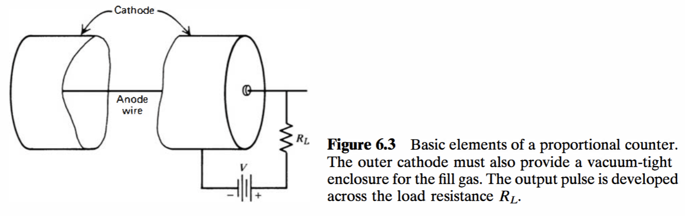
<br>
<b>(a)</b> Basic proportional counter geometry
</td>

<td align="center" width="55%">
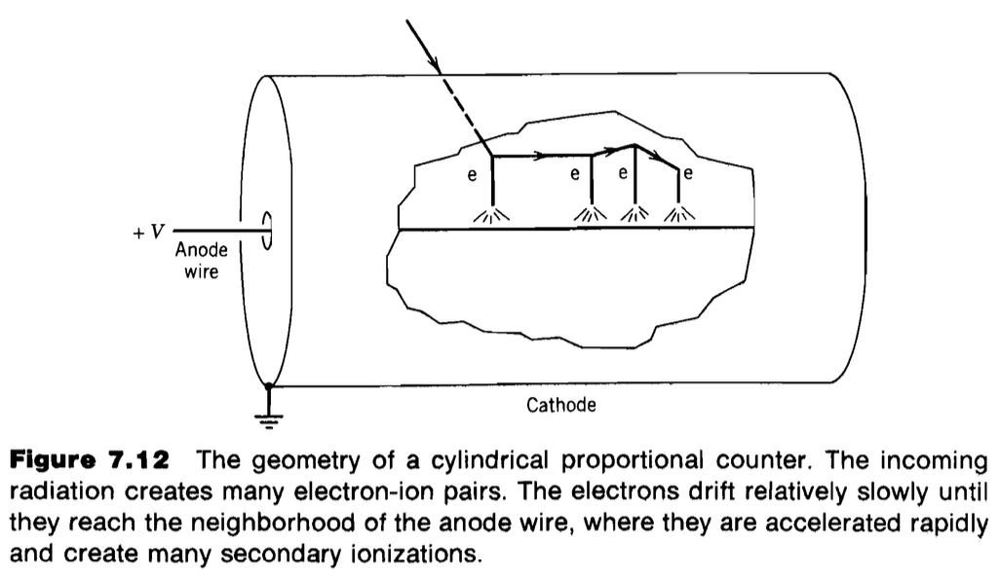
<br>
<b>(b)</b> Gas amplification and electron avalanche formation
</td>
</tr>
</table>

<p align="center">
<em>
Operating principle of a gas-filled proportional counter.
(a) The cylindrical detector geometry consisting of a central anode wire and outer cathode.
(b) Ionization electrons generated by incident radiation drift toward the anode where strong electric fields initiate Townsend avalanches, producing an output pulse proportional to the deposited energy.
</em>
</p>

_**Scintillators expanded neutron detection beyond counting**_

The next major innovation into the field came through the development of scintillator-based detectors. These detectors, instead of collecting charge directly, convert neutron interactions into flashes of light which can then be measured using photomultiplier tubes (PMT), silicon photomultipliers, or other optical readout methods.

These detectors advanced the field of neutron detection and broadened the amount of information that could be extracted from neutron measurements. Scintillators enabled faster timing measurements, improved sensitivity to fast neutrons, neutron imaging systems, and in some cases neutron spectroscopy. As a result, scintillators became widely adopted across various applications including fusion reactors, oil and gas logging systems, security use cases, and industrial imaging platforms.

Today, scintillator technologies remain among the most dominant detectors applied across the industry. Their flexibility, speed, and ability to perform across a range of neutron energies allowed them to grow in popularity at an exponential rate. Thus, establishing the device as a central component of modern neutron instrumentation.

<table align="center">
<tr>
<td align="center">
<b>(a)</b><br>
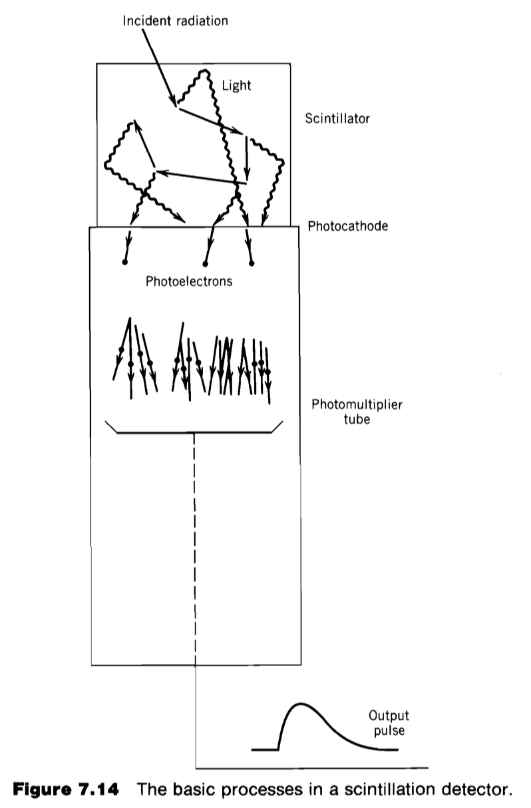
</td>

<td align="center">
<b>(b)</b><br>
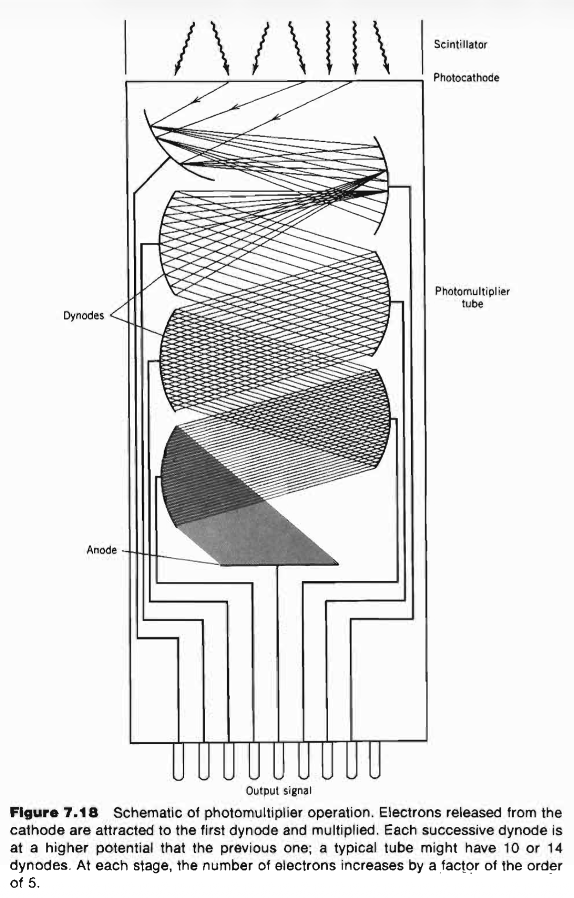
</td>
</tr>
</table>

<p align="center">
<b>(c)</b><br>
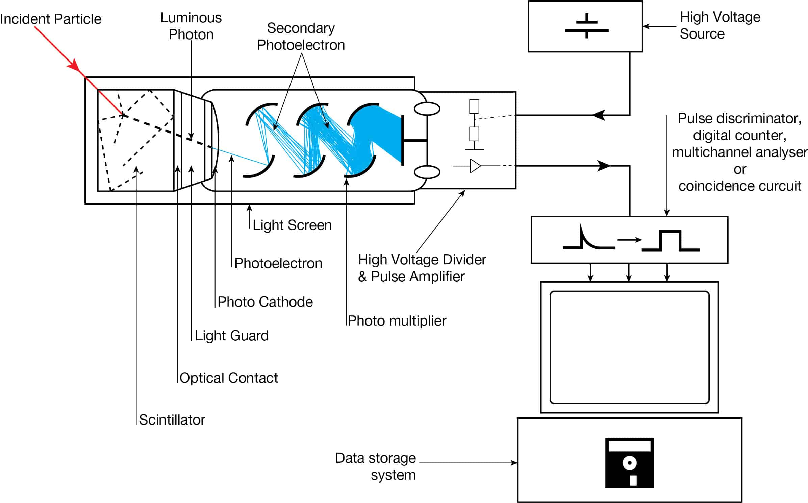
</p>

<p align="center">
<em>
Operation of a scintillation detector system.
(a) Conversion of incident radiation into scintillation photons.
(b) Electron multiplication within a photomultiplier tube (PMT).
(c) End-to-end detector architecture including scintillator, PMT, pulse processing electronics, and data acquisition system.
</em>
</p>

_**The helium-3 shortage forced innovation**_

For many years of the nuclear era, helium-3 detectors completely dominated market share within the neutron detection landscape. That dominant position quickly dissolved during the late 2000s when a global shortage of helium-3 constrained its practicality in detectors.

The supply drought exposed a vulnerable point within the industry. Many neutron detection systems at the time depended on a material that was increasingly difficult and expensive to obtain, rendering the use of neutron detection impractical. Governments, private companies, and national laboratories responded to this bottleneck by accelerating efforts to develop novel technology that did not rely on helium-3 supply.

This period of pressure marked a turning point for neutron diagnostics. Significant investment flowed into different paths of detection, including boron-10 detectors, lithium-based systems, solid-state architectures, and other emerging solutions. This resulting push for new approaches fed inspiration to many of the detector platforms now being commercialized. In fact, many modern detectors can trace their origins to research programs initiated during this era of desperation.

_**Semiconductor detectors enabled digital architectures**_

As electronics advanced, neutron detection increasingly moved toward semiconductor-based approaches. Instead of large gas volumes or optical processes that add additional steps, the use of solid-state materials and neutron conversion layers allow these devices to generate electric signals directly within the device architecture.

Semiconductor detectors are so appealing because of their compatibility across the broader semiconductor ecosystem. Unlike many traditional detector technologies today, semiconductor devices can be miniaturized, integrated directly with readout electronics, fabricated into highly pixelated arrays, and manufactured using advanced processes derived from the modern microelectronics industry. All of which could contribute to a future where all essential elements are housed on-chip.

This opens up doors that extend far beyond traditional neutron counting. Large-area detector panels, digital imaging systems, and many more groundbreaking innovations become significantly easier to envision when detection and electronics are built into the same architecture.

As a result, semiconductor detectors of all types have become some of the most active areas of development. Polymer based detectors, solid-state architectures, and many other emerging technologies are being explored across various industries. The most prominent of those being fusion diagnostics, safeguards, medical applications, industrial imaging, and space systems. While many of these technologies have not displaced the more established detectors, they offer a pathway toward scalable, digital neutron detection that is difficult to achieve using traditional gas-filled detectors alone.

For this reason, many engineers view semiconductor detectors as a potential platform capable of supporting a wide range of future neutron measurement systems.

<table align="center">
<tr>

<td align="center" width="60%">
<b>(a)</b><br>
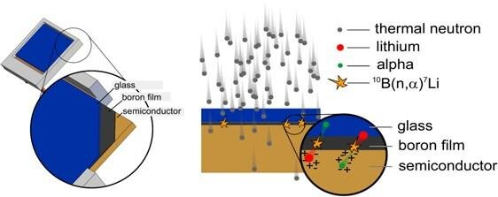
<br>
Neutron capture and charge generation
</td>

</tr>
</table>

<br>

<table align="center">
<tr>

<td align="center" width="45%">
<b>(b)</b><br>
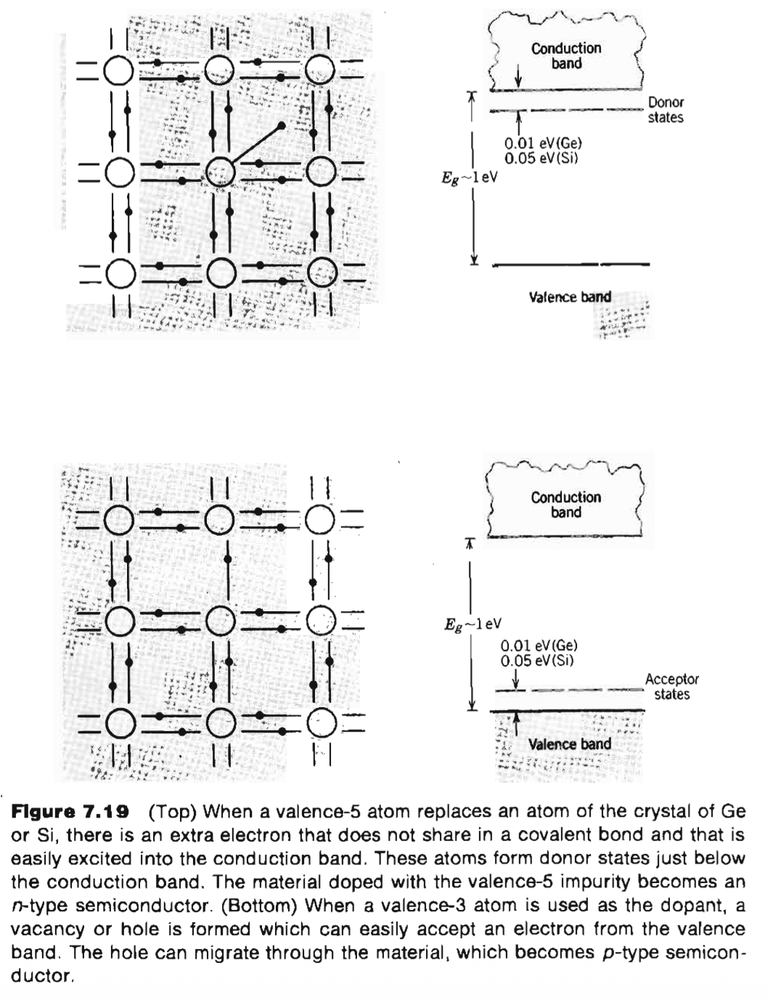
<br>
Semiconductor doping and carrier formation
</td>

<td align="center" width="55%">
<b>(c)</b><br>
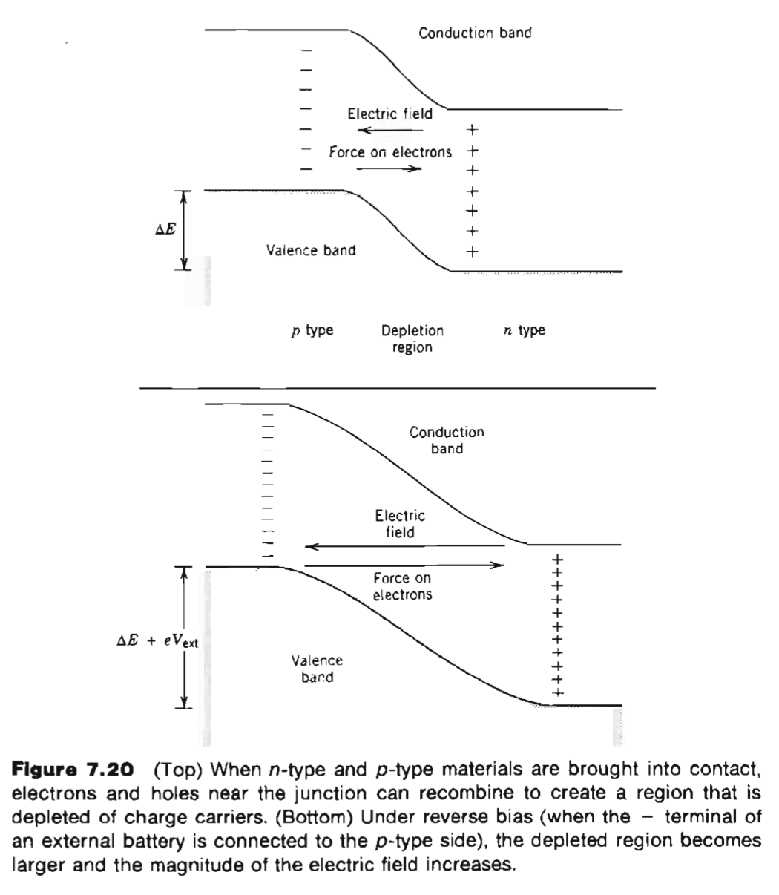
<br>
Depletion region and charge collection
</td>

</tr>
</table>

<p align="center">
<em>
Operating principle of a semiconductor neutron detector.
(a) Incident neutrons interact within a conversion layer (e.g., <sup>10</sup>B), producing charged particles capable of entering the semiconductor.
(b) Semiconductor doping creates n-type and p-type regions that define charge transport behavior.
(c) A reverse-biased p-n junction forms a depletion region where electron-hole pairs are separated and collected, generating the detector signal.
</em>
</p>

_**Diamond detectors emerged for extreme environments**_

A specialized branch of detectors have become especially important for the harshest radiation environments: diamond detectors. Diamond is technically a wide-bandgap semiconductor material, but diamond detectors are often treated as a distinct detector class. This is because their performance profile and applications differ substantially from conventional semiconductor neutron detectors discussed prior. Its properties make it unusually well-equipped for situations where conventional detector materials degrade. Recent [reviews](https://www.intechopen.com/online-first/1228610) highlight its high carrier mobility, low dark current, strong radiation resistance, high breakdown field, and exceptional thermal conductivity. These are key reasons why it has attracted attention for radiation detection in extreme conditions.

The appeal of diamond detectors does not stem from it being cheap or easy to manufacture. In fact, these devices are quite the opposite. The appeal is that it can operate at a very high level in situations where other detectors struggle. Compared to silicon- and germanium-based detectors, these diamond detectors can offer lower dark current, faster time response, and stronger environmental adaptability. Improvements in chemical vapor deposition (CVD) have also made high-quality single-crystal diamonds more reproducible in development. This has pushed diamond detectors towards scenarios in industry where they are being widely manufactured and used. Thus, sparking the curiosity of many in the field.

Currently, there has been a big push in the fusion industry for them. Helion Energy, one of the leading companies, have published neutron results utilizing these detectors. Fusion diagnostics require detectors to operate consistently in high flux radiation fields, high neutron fluence, and intense gamma backgrounds. All these conditions can degrade materials over time quickly if not structurally suited for them. Diamond detectors however, have demonstrated stable operation under 14 MeV neutron irradiation, high-temperature neutron measurement, and fast neutron spectral evaluation using pulse-shape discrimination. In fusion reactors, where D-T reactions produce 14.1 MeV neutrons, those characteristics make diamond one of the more attractive detector modalities for spectroscopy, timing measurements, and plasma diagnostics.

The key tradeoff is manufacturability. Diamond detectors are, of course, expensive, difficult to scale into large-area arrays, and depend on high-quality crystal growth. Thus, their viability in the near term are likely not a universal replacement for the gas-filled detectors or scintillators being widely used in industry. Instead, they have practicality in scenarios where performance in extreme conditions matters more than cost. This could be applied to fusion reactors, high-energy physics facilities, nuclear reactor monitoring, deep-space exploration, and other environments where detector survivability is a primary design constraint.

Diamond detectors represent the side of the market where high-performance and durability under intense conditions constrain development. They also reveal a core question that many engineers face and many investors pose: whether neutron detector architectures can eventually combine extreme durability, digital integration, spectral information, and scalable manufacturing in ways that traditional detector families cannot.

<p align="center" width="100%">
    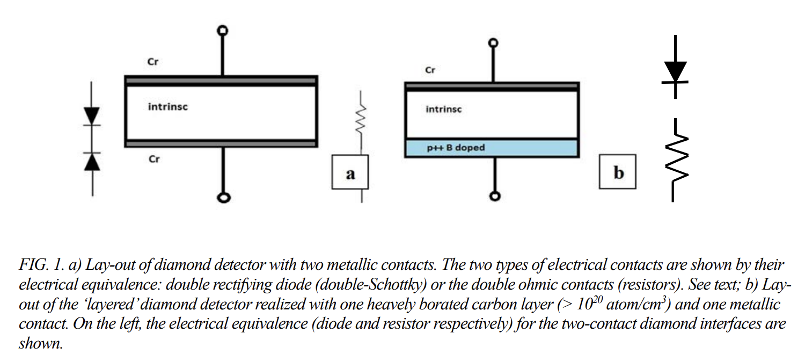
</p>

_**The field fragmented into application-specific solutions**_

Neutron detection as a field did not converge to a singular solution. New applications caused the development of devices that better suited different environmental and informational requirements. Each discipline required a different combination of efficiency, timing resolution, energy discrimination, spatial resolution, durability, and cost.

The result is a landscape composed of specialized solutions. Gas-filled detectors continue to dominate some applications. Scintillators currently remain critical in a wide range of fields. Semiconductor approaches and diamond technologies are expanding into areas where traditional detectors face limitations.

Understanding this fragmentation is essential. It lays the groundwork for why the neutron detection market cannot be captured by any singular product or categorized as a singular industry.

---

## 2) Market Applications & Requirements Framework

> “A jack of all trades is a master of none.” Few fields embody this principle more clearly than neutron detection.

Different applications of neutron detection impose their own unique detector requirements. In practice, no single detector can "rule them all." Instead, the optimal sensor is chosen to meet the needs of the given market (as motivated in Section 1.3) In what follows, we survey each application domain and then break down the key detector requirements (spatial/temporal resolution, energy response, etc.) in that context.

---

### 2.1 Fusion Energy

Fusion devices (tokamaks, stellarators, Z-pinches, laser fusion, FRCs) demand neutron detectors that can measure plasma performance in real time. Key quantities include total neutron yield (for fusion power), the D-D/D-T branching ratio (for fuel composition), and neutron spectra (for ion temperature and rotation). The neutron energies for fusion are high (2.45 MeV for D-D and 14.1 MeV for D-T reactions) and the flux can be enormous. As an example, ITER's peak neutron rate is around 5*10^20 n/s. Detectors must tolerate high radiation and often operate in-vessel or close to the plasma (high magnetic fields, vacuum, and high temperature). Although, the future may see external panels operating around the reactor rather than internally. We will now discuss relevant outputs of neutron detectors:

- **Spatial Resolution:** This is valuable because the distribution of neutron emission provides direct information about where fusion reactions are occurring within the plasma. The neutron source profile can reveal changes in fuel distribution, plasma confinement, heating efficiency, and the onset of instabilities that impact reactor performance. Fusion research increasingly cites the use of neutron cameras and profile monitors to infer the neutron source distribution. This requires multi-element detector arrays or [collimated imaging systems] with centimeter-scale resolution. (Collimated "neutron camera" systems on JET/ITER aim for a few cm imaging resolution over the plasma.) However, a trade-off exists. Improving spatial detail generally means counting from smaller solid angles, which reduces signal statistics.
- **Temporal Resolution:** Fusion plasmas can transition drastically. In some cases, moving from stable operation to disruption in milliseconds is a reality. Temporal resolution determines whether a detector simply records that an event occurred or whether it can reveal the stages of the underlying physical processes that caused it. A "regular" neutron yield monitor for steady-state power can work at around 10 ms resolution. However, studies of fast transients or fuel burnup often require sub-ms timing. Modern fusion detectors (fast scintillators, diamond detectors, fission chambers) aim for microsecond or better response. The dynamic range is also extreme. For example, ITER will see changes in neutron rate spanning ~10^12 from (10^8 n/s in calibration shots to 5*10^20 n/s at full power.) Detectors must remain linear across many decades (orders of magnitude on a base‑10 scale) or be arranged in complementary gain stages.
- **Spectral Distribution:** The neutron energy spectrum contains valuable information. It reveals ion temperature, fuel composition, and plasma rotation. Without spectral ability, a detector can estime fusion power but it cannot fully characterize the state of the plasma. Due to this, spectral distribution is key. Diagnosing fuel ion temperature relies on measuring neutron Doppler broadening. For D-T fusion, a few-percent energy resolution at 14 MeV is required to resolve keV-scale temperature effects. This drives the use of neutron spectrometers (e.g. magnetic-proton recoil systems, time-of-flight arrays, or high-pressure scintillators) which have better energy resolution than traditional counters. In contrast, simple yield monitors (fission chambers) do not provide energy info. Many systems combine both fast spectrometers for detailed physics and robust counters for total yield.
- **Gamma Discrimination:** In high-power fusion systems, gamma backgrounds can exceed neutron signal levels in portions of the reactor. Gamma discrimination therefore becomes essential not simply for measurement quality but for determining whether a detector is measuring fusion neutrons at all. Fission chambers are naturally gamma-insensitive. Scintillators use pulse-shape discrimination oftentimes to reject gammas. High gamma flux also necessitates heavy amounts of shielding around the detector electronics.
- **Form Factor & Geometry:** Many visions for fusion detectors imagine them fitting into limited ports or attaching to the vacuum vessel. For example, ITER will deploy pencil-style fission chambers and "microfission" chambers embedded into the vacuum vessel. These must operate, of course, in a vacuum, high field and up to ~200°C (or higher, depending on blanket design.) In-vessel detectors must also be strong against magnetic fields and vibrations. Ex-vessel detectors (ex: neutron cameras) have more flexibility in size but still face space constraints. In the long term, many fusion companies seek a series of detectors arranged in a paneled array system surrounding the reactor, according to conversations with engineers and executives alike.
- **Environmental Constraints:** Fusion diagnostics face the harshest conditions. All detectors (and readout electronics) must tolerate these conditions without excessive degradation. For example, ITER’s 235-U microfission chambers have been tested to ~10^15 n/cm^2 fluence with only ~0.1% sensitivity loss. Thus, the development of durable devices in this application is key.
- **Cost & Scalability:** Historically, detector cost has been a secondary concern in fusion. This is because machines themselves cost billions of dollars. each detector is typically a high-performance, purpose-built instrument, making their performance justify any cost concerns at the moment. However, future commercial reactors may require distributed sensing networks with hundreds or thousands of monitoring points. Thus, making scalability potentially a more important design constraint than it has been in experimental facilities.

<table align="center">
<tr>
<td align="center">
<br>
Tokamak Energy
</td>

<td align="center">
<br>
COMPASS
</td>
</tr>
</table>

<p align="center"><em>Fusion plasmas visualized in two magnetic confinement systems.</em></p>

---

### 2.2 Fission Reactors & SMRs

Commercial fission reactors (and emerging SMRs/Gen-IV designs) use neutrons for core monitoring and control. The neutron energy in thermal reactors is predominantly in the thermal and epithermal range (keV to eV). Important uses include measuring reactor power (neutron flux ∝ power), detecting fuel anomalies, and controlling reactivity. Detectors may be in-core (self-powered neutron detectors, SPNDs) or ex-core (long-lived fission chambers or rhodium detectors) positioned around the core.

- Spatial Resolution: Spatial mapping of the flux (e.g. flux shape monitoring) is achieved by deploying many localized detectors or by in-core traverse. Typical fuel assemblies might have a few tens of detectors spaced around the core circumference. The “resolution” is essentially one detector per assembly or channel (meter-scale resolution across the core). High granularity like imaging is generally unnecessary.
- Temporal Resolution: Reactor power changes are relatively slow (seconds or minutes), so detectors can integrate over long times. Millisecond timing is not needed; even 1 second is often sufficient. However, detectors must have low drift over hours and days. Fast transients (scrams) are monitored, but 10–100 ms resolution is usually adequate.
- Spectral Response: Since reactors produce mostly thermal neutrons, detectors are usually optimized for thermal sensitivity. For example, SPNDs (rh- or vanadium-based) or fission chambers use ^235U or ^10B to capture thermal neutrons. Some designs (fast reactors) may require response to fast neutrons as well, but in thermal systems this is minor. Energy discrimination is typically not required beyond the thermal sensitivity.
- Gamma Discrimination: The gamma flux in reactor cores is very high, so detectors must be gamma-blind or use compensation (e.g. SPNDs have minimal gamma response by design). For ex-core detectors, gamma shielding is used. The detectors should maintain neutron sensitivity even during intense gamma backgrounds (as noted for safeguards detectors).
- Form Factor & Geometry: In-core detectors must withstand high temperature (~300–600°C for LWRs, up to ~800°C in high-temperature reactors) and high pressure. They are often long rods or cables inserted into assemblies. Ex-core detectors (flux monitors) are bulky (meters long) and attached outside the pressure vessel. Size is governed by existing instrument tunnels and can be large.
- Environmental Constraints: The reactor environment is harsh: high neutron fluence over years, high gamma background, vibration, and for SMRs, higher temperature coolants (lead, sodium, molten salt). Detectors must survive thousands of hours with minimal calibration. Some advanced designs aim for high-temperature neutron detectors (e.g. diamond or SiC) that can operate directly inside hot reactor cores. Reliability and maintenance-free operation (decades-long life) are paramount.
- Cost & Scalability: Nuclear power plants tolerate higher capital cost for detectors, but still favor long-lived devices with low maintenance. The number of sensors is moderate (tens to hundreds per plant). Upgrading fuel cycles or cores often requires requalification of detectors (e.g. licensing, recalibration).

---

### 2.3 Nuclear Safeguards & Special Nuclear Materials (SNM)

Safeguards operations aim to detect and quantify special nuclear materials (plutonium, highly enriched uranium) to prevent proliferation. SNM emits neutrons (via spontaneous fission or induced multiplication), but often at very low rates. Detectors in this field include portals, hand-held detectors, and assay systems. Key requirements are sensitivity and discrimination.

- Spatial Resolution: Typically only point measurements are needed. The goal is to detect a hidden source, not to image it. For inventory verification, detectors are placed around or within containers (“well counters”, slab counters) to maximize efficiency. Spatial resolution finer than ~10–30 cm is rarely needed.
- Temporal Resolution: SNM detection is not about fast transients; it’s about accumulating counts until a confidence threshold. Integration times might be several seconds to minutes. In portal monitors, a few-second dwell time is common. Real-time alert is less critical than achieving low false-alarm rates.
- Spectral Response: Energy resolution is not generally required. Both fast and thermal neutrons can be useful (e.g. fast neutrons are a signature of SNM), but most safeguards detectors use moderators (polyethylene) to slow neutrons and increase detection efficiency. The neutron spectrum of SNM (tens of keV to MeV) is broad, but detectors usually count captures (e.g. on ^3He, ^10B, or ^6Li).
- Gamma Discrimination: Extremely important. Any SNM detector must reject false alarms from natural background or NORM (naturally occurring radioactive materials). As noted by Safeguards studies, the top requirements are “high absolute detection efficiency” and “low intrinsic gamma sensitivity”. Modern systems (e.g. He-3 portals or composite scintillators) achieve gamma rejection ratios of 10^6:1 or better. In operational terms, detectors often pair a moderator-wrapped thermal neutron counter with a gamma counter to veto coincident gammas.
- Form Factor & Geometry: Equipment ranges from hand-held friskers to fixed portal monitors. Portals are typically ~2 m wide to screen vehicles, with banks of ^3He or boron-tubes on either side. Hand-helds are small tubes or scintillator paddles. Instrumentation must be robust and easy to operate (often by customs officers with minimal training). They should operate unattended (power loss alarms, self-checks) and have secure data logging.
- Environmental Constraints: Generally moderate: indoor use, ambient conditions. Portals may be outside but have weather protection. Temperature range ~0–50 °C. Detectors must be rugged for continuous operation (e.g. few false alarms over years). Some specialized detectors (e.g. at fuel storage sites) operate outdoors and must survive wider temperature swings.
- Cost & Scalability: The number of detectors in safeguards is large (worldwide agencies deploy thousands of detectors), but per-unit cost must be moderate. Historically, this sector drove the He-3 shortage; modern efforts use ^10B, ^6Li, or scintillators to reduce cost. Backward compatibility (fitting new detectors into old portal enclosures) is often a requirement. Because the physics signature is weak, many detectors are often used in coincidence or coincidence+tomography to improve confidence.

---

### 2.4 Industrial Imaging & Non-Destructive Testing (NDT)

Industries use neutrons to image or characterize materials that are opaque to X-rays (e.g. hydrogenous fluids in metal enclosures, rubber, ceramics). Typical examples are turbine blade inspection, rocket motor inspection, or fuel cell studies. These applications use dedicated neutron sources (reactors or sealed sources) and imaging cameras or digital detectors.

- Spatial Resolution: Critical. Neutron imaging is a true imaging application. Resolutions of ~0.1–1 mm are often needed to see fine cracks or small voids. Modern neutron cameras use scintillator screens (ZnS:Ag/LiF or similar) coupled to CCD/CMOS cameras, or pixelated detectors (e.g. MCP or ^6Li glass arrays) to achieve sub-millimeter resolution. Tomographic (3D) imaging requires hundreds of projections, but each projection still needs high resolution.
- Temporal Resolution: Usually slow. A single image exposure might take seconds to minutes, depending on flux. Fast timing is not needed. The main temporal issue is stability (detector drift) and synchronization (for tomography). Real-time video-rate imaging is generally not required in industrial NDT.
- Spectral Response: The beam spectra can vary (thermal to epithermal). Some imaging setups use energy discrimination to separate fast neutrons (for contrast) from thermal ones. However, most thermal or cold neutron imaging detectors simply count captures (no spectroscopy). If using pulsed sources, time-of-flight can be used for energy-resolved imaging. In general, imaging detectors need a broad response to capture the available neutrons (often epithermal neutrons give best contrast in metals).
- Gamma Discrimination: Background gammas can blur the image. For high-contrast neutron images, detectors often incorporate gamma-insensitive scintillators (e.g. ZnS/LiF which is gamma-blind) or require shielding filters (e.g. lead) so that primarily neutrons reach the detector. Since the source is usually a nuclear reactor or isotope, there is always a gamma field to reject.
- Form Factor & Geometry: Industrial imaging detectors are often flat-panel cameras (~10–30 cm across) or even large arrays (1 m^2) for imaging larger parts. They must fit on beamlines or portable rigs. The size depends on the object size. Some systems are collimated (line-scanners), others use open beams with film/CCD capture. The mechanics (rotation stages, etc.) can be bulky.
- Environmental Constraints: Laboratory conditions (room temperature, moderate radiation fields). The main constraints are detector robustness (scintillators should not deteriorate under sustained use). For on-site NDT (e.g. power plant inspections), portability and ruggedness matter.
- Cost & Scalability: Neutron imaging is specialized, so detectors are often custom and expensive. There are relatively few industrial beamlines globally, so detector production volume is low. Commercial cameras cost tens of k$, but feature high spatial resolution and area.

---

### 2.5 Medical Therapy & Imaging

Neutrons are used in a few medical contexts, primarily Boron Neutron Capture Therapy (BNCT) and neutron dosimetry for high-energy X-ray therapy. In BNCT, patients are irradiated with an epithermal neutron beam (usually ~1 keV neutrons) to treat tumors. Detectors here monitor beam flux and patient dose.

- Spatial Resolution: For therapy beam monitoring, spatial resolution is modest: detectors are large-area flux monitors, not imaging devices. However, for beam profiling, one might scan a small detector across the beam. Resolution on the order of centimeters is sufficient. In-room imaging of boron distribution (beyond scope) uses MRI/PET, not neutrons.
- Temporal Resolution: The neutron beam intensity is slowly varying. Beam monitors need to respond in real time (on the order of 0.1–1 s) to adjust dose delivery, but not faster. Detector signals can be averaged over seconds.
- Spectral Response: BNCT specifically requires epithermal neutrons (~0.5–10 keV) for deep penetration. The detector must therefore be sensitive in that energy range and robust against the accompanying fast and thermal neutrons. Dosimetry often requires separating neutron vs gamma dose; boron-coated detectors (4π detectors) or multi-layer spectrometers are used to measure energy distribution. The therapy beam specs (for example, ≥5×10^8 n/cm^2/s epithermal flux, and minimal fast/neutron contamin
- Gamma Discrimination: In medical environments, high-energy X-rays (used for imaging or therapy) produce neutrons in surroundings, but the beam itself is pure neutrons. Detector systems must distinguish neutrons from any incidental gammas, especially for staff and patient dosimetry. Often this uses moderated detectors or activation foils rather than direct scintillation.
- Form Factor & Geometryz: Monitoring detectors may be placed in the beamline (e.g. before patient), or worn as personal dosimeters. They must not significantly attenuate the therapy beam. Size is thus constrained: small form-factor detectors (handheld probes or small panels) are preferred. Some systems use multiple detectors around the patient to reconstruct dose.
- Environmental Constraints: Hospital environment (20–25 °C, regulated). Neutron fluxes are high near the beam, so detectors must withstand ~10^8–10^9 n/cm^2/s for the duration of treatment. They also must meet strict medical device regulations (biocompatibility, sterilizable housings, etc.).
- Cost & Scalability:: BNCT is still rare; facilities are few. Detector cost is less constrained than in consumer markets, but must be reliable and easy to use by medical staff. Future widespread adoption would push for smaller, safer, and automated detectors.

---

### 2.6 Oil & Gas

In oil and gas exploration, neutron porosity logging uses pulsed or isotopic neutron sources to probe formation hydrogen content. Detectors are mounted in drilling tools under extreme conditions.

- Spatial Resolution: Very coarse. A logging tool measures an average signal over meters of formation as the drill string moves. The “resolution” is set by the tool spacing (~0.5–1 m). High granularity is not needed.
- Temporal Resolution: Tool readings are taken continuously as the bit drills, effectively sampling every meter or so. Integration times are on the order of 0.1–1 s for each depth step.
- Spectral Response: Typically thermal detectors are used (e.g. He-3 or compensated HF detectors inside polyethylene). The goal is to count slowed (thermalized) neutrons which correlate with hydrogen concentration. Some tools also measure epithermal flux by using two detectors (compensated logging) to deduce formation porosity. The source is usually a ~10 MeV neutron generator or ~14 MeV source (deuterium-tritium), so detectors see a broad spectrum.
- Gamma Discrimination: Formation gamma (from tool activation or natural K/U/Th) can generate background counts. Logging tools often use gamma-blind detectors (He-3 or plastics with pulse-shape) or electronic gating to reduce gamma pulses. The downhole electronics also calibrate out known gamma responses.
- Form Factor & Geometry: Tools are rugged cylinders ~5–10 cm in diameter and up to a meter long, containing source and one or more detectors. They must survive hydraulic pressure, shock, vibration, and rotate freely in the well bore. The detector’s pressure housing is often metal (stainless steel) to withstand up to ~140 MPa. Space is limited, so detectors must be compact (e.g. small He-3 tubes or scintillators).
- Environmental Constraints: Extreme: up to ~175 °C (for high-end drilling), high pressure (superheated fluid), corrosive environments. Electronics must be oil- and gas- proof. The detectors must maintain calibration over years of field use with minimal maintenance (usually tool is retrieved yearly).
- Cost & Scalability: Each logging tool is expensive, but used to survey entire wells. Because tools are few in number, each detector can be a premium device. However, reliability is paramount to avoid costly downtime. There is also interest in downhole semiconductor detectors (SiC, etc.) for temperature resilience, which could reduce tool complexity.

---

### 2.7 Defense & Space

This category includes military applications (radiation portal monitors, battlefield detectors, ship/submarine sensors) and space missions (neutron dosimetry, planetary surveys). Key challenges are miniaturization, robustness, and broad-spectrum operation.

- Spatial Resolution: Generally low. Portal monitors or area monitors only count integrated flux; handheld devices have a single detector element. Some applications (e.g. mapping lunar neutron flux) use arrays but typically coarse (meter-scale). Imaging is uncommon. The focus is on sensitivity and directional sensing, not fine spatial mapping.
- Temporal Resolution: Reaction time can be seconds (e.g. scanning a container) to minutes (on-the-fly background monitoring). Military troops might need sub-second alarms, but the detectors themselves integrate counts. Pulse-mode spectrometers (like NASA’s “Fast Neutron Spectrometer”) can provide spectra on the order of seconds.
- Spectral Response: For threat detection, both fast and thermal neutrons carry information (fast neutrons indicate multiplication in SNM). Some systems (e.g. Stilbene or plastic scintillators) attempt rough spectroscopy to distinguish sources. Space instruments (like on ISS) use fast organic scintillators to measure neutron energy up to tens of MeV. Generally, detectors should have a broad dynamic range (thermal through fast).
- Gamma Discrimination: Critical in defense. A naval vessel or vehicle will have high gamma-ray backgrounds (natural or from hardware), and false alarms are unacceptable. Many systems use dual-layers or pulse-shape to identify neutrons (e.g. EJ-309 liquid scintillator which has good n/γ PSD). Some advanced portal monitors can separately report gamma vs neutron counts.
- Form Factor & Geometry: Requirements span miniaturized wearables (astronaut dosimeters, soldier personal detectors) to large-scale (shipboard monitoring, satellite payloads). For example, a space neutron spectrometer must be compact and low-power (like the plastic+fiber design used on ISS). Military handhelds fit in a vest, so silicon photomultipliers and compact scintillators are popular. Portals and fixed sensors prioritize ruggedness.
- Environmental Constraints: Harsh. Space detectors face vacuum, large temperature swings (−100 °C to +50 °C or more), and must be radiation-hardened over years. Defense sensors may encounter humidity, shock, and must run on batteries or minimal power. All must operate reliably with little maintenance and often have to survive launch/flight or combat conditions.
- Cost & Scalability: Defense budgets allow for more expensive, highly capable devices, but ease of production is still valued (COTS components are often used). Space missions are extremely cost-sensitive per unit mass. For widespread deployment (e.g. monitoring at many ports), lower-cost boron-lined detectors are increasingly used.

> **TAKEAWAY:** Each application imposes its own niche of requirements. Fusion needs speed, high-energy capability, and radiation hardness; fission reactors need longevity and thermal sensitivity; safeguards demand high efficiency and gamma rejection; imaging demands high spatial resolution; medical demands patient-safe monitoring and epithermal response; oil/gas demands ruggedness and thermal stability; scientific facilities demand high count rates and large areas; and defense/space demand portability and broad-spectrum sensitivity. There is no one-size-fits-all neutron detector – instead, sensor design is tightly matched to the end-use scenario.

---

## 3) Deep Dives Into Key Modern Markets

While Section 2 established the fundamental detector requirements across major neutron applications, those requirements are ultimately driven by the practical challenges faced by end users. To better understand these challenges, discussions were conducted with engineers, scientists, and technical leadership from commercial fusion companies, advanced fission developers, national laboratories, defense organizations, government agencies, and industrial imaging groups. The following sections synthesize the key insights from these conversations, highlighting where existing neutron detector technologies remain insufficient and identifying the capabilities that stakeholders believe will define the next generation of neutron measurement systems.

---

### 3.1 Fusion Diagnostics

While the literature provides a strong understanding of the technical requirements for fusion neutron diagnostics, discussions with engineers and scientists developing commercial fusion systems offer additional insight into where current detector technology falls short. Throughout this work, conversations were conducted with diagnostic teams and technical leadership spanning Commonwealth Fusion Systems (CFS), Xcimer Energy, Realta Fusion, Pacific Fusion, SHINE Technologies, Thea Energy, the Fusion Industry Association (FIA), and researchers at the Laboratory for Laser Energetics (LLE) operating the OMEGA laser facility. Although reactor architectures differ substantially between magnetic confinement, inertial confinement, and field-reversed configuration (FRC) systems, a consistent theme emerged: future fusion reactors will require significantly more information than total neutron yield alone.

**Xcimer Energy**

Discussions with Xcimer Energy provided valuable insight into the future direction of neutron diagnostics for laser inertial confinement fusion (ICF). Rather than emphasizing conventional neutron counting, the discussion centered on developing diagnostic systems capable of reconstructing the complete spatial, temporal, and spectral evolution of each fusion shot. Gerrit Bruhaug described an ideal diagnostic architecture consisting of approximately nine independent lines of sight capable of simultaneously producing temporally resolved and energetically resolved measurements. Such a system would enable researchers to infer laser imbalance, burn symmetry, plasma evolution, and implosion performance from a single experiment, moving beyond the current paradigm of collecting individual diagnostic quantities from multiple independent instruments.

Temporal resolution emerged as perhaps the most demanding performance requirement. Unlike magnetic confinement devices, laser-driven fusion experiments occur on extraordinarily short timescales, with burn durations approaching tens of picoseconds. Xcimer emphasized that future diagnostics must distinguish prompt fusion neutrons from later-arriving down-scattered neutrons to reconstruct the temporal evolution of the burn and surrounding plasma. Rather than recording only an integrated neutron yield, the desired detector would effectively produce a time-gated measurement capable of revealing how the implosion evolves throughout the shot. Although current detector architectures may not yet achieve the temporal response necessary for direct observation of sub-50 ps burn dynamics, this capability was viewed as a long-term objective that would fundamentally improve the understanding of laser-target interactions.

Spatial information was considered equally valuable, particularly when coupled with fast timing. Rather than simply increasing pixel count, Xcimer envisioned detector arrays capable of producing time-dependent neutron images that reveal where neutron production and scattering occur during different stages of the implosion. Multiple viewing angles were viewed as essential for reconstructing burn symmetry and diagnosing laser non-uniformities. This perspective reflects a broader transition away from single-point neutron monitors toward distributed imaging systems capable of resolving neutron emission both spatially and temporally.

Energy resolution represented another major area of interest. Discussions focused on measuring neutron Doppler broadening to estimate ion temperature while simultaneously separating primary fusion neutrons from down-scattered populations. The concept of “energy-resolved pixels” was repeatedly discussed as a desirable long-term capability, whereby individual detector elements would provide not only position and timing information but also local spectral information. Such measurements would substantially increase the diagnostic information extracted from each fusion shot compared with conventional yield monitors.

System-level performance requirements proved equally important. Absolute neutron yield remains one of the primary figures of merit for evaluating fusion performance, requiring detectors with rigorous calibration and excellent long-term stability. Xcimer emphasized that measurements must maintain high signal-to-noise ratios while remaining linear across an exceptionally large dynamic range, allowing weak spectral features to be measured without saturating under the dominant neutron signal. Discussions also highlighted detector efficiency as a primary design consideration. Because neutron detection efficiency scales strongly with converter thickness, future detector architectures must balance neutron capture probability against charge transport, timing performance, and manufacturability. Quantifying this relationship was viewed as an essential step toward evaluating any new detector technology.

Collectively, the discussions with Xcimer illustrate that future laser fusion diagnostics will require substantially more than high-efficiency neutron counting. Instead, the desired systems integrate absolute yield measurements with simultaneous spatial localization, temporal evolution, and neutron spectroscopy within a single diagnostic architecture. Although such an instrument does not yet exist, the performance objectives identified by Xcimer closely align with broader trends observed throughout the commercial fusion industry and further motivate the development of next-generation semiconductor neutron detectors capable of providing multidimensional neutron measurements rather than individual diagnostic quantities in isolation.

**Realta Fusion**

Discussions with Realta Fusion similarly highlighted several practical limitations of current fusion neutron diagnostics. Existing neutron instrumentation within their diagnostic suite relies primarily on activation-based yield measurements (e.g., rhodium activation foils) for absolute neutron yield alongside scintillator-based systems employing pulse-shape discrimination for neutron-gamma separation. While these approaches provide reliable measurements, they remain limited in their ability to simultaneously capture multiple diagnostic quantities from a single detector platform. In particular, activation diagnostics provide excellent integrated yield measurements but inherently sacrifice temporal information due to radioactive decay times, requiring complementary detector systems for time-resolved measurements.

A recurring theme throughout the discussion was the desire to increase neutron detection efficiency without sacrificing other detector performance characteristics. It was noted that many existing detector technologies exhibit relatively low intrinsic neutron detection efficiencies, requiring compromises between efficiency, detector size, and measurement fidelity. The ideal detector was described as approaching complete neutron detection efficiency while simultaneously providing improved spatial, temporal, and spectral resolution—an objective that remains beyond the capabilities of current neutron detector technologies.

Magnetic confinement environments also introduce engineering constraints beyond detector sensitivity alone. Realta emphasized that diagnostics deployed near the reactor must operate reliably in strong magnetic fields, motivating the transition away from conventional photomultiplier tubes toward silicon photomultipliers (SiPMs) and other magnetic-field-insensitive readout technologies. These system-level constraints increasingly influence detector selection as much as the underlying neutron detection physics.

Another capability identified as highly desirable was the ability to distinguish neutron production occurring throughout different regions of the plasma. Because fusion neutrons are emitted nearly isotropically, determining their point of origin remains inherently challenging using conventional detector systems. Spatial information therefore depends heavily on collimation or multiple lines of sight rather than detector sensitivity alone. The discussion reinforced the growing interest in neutron imaging architectures capable of combining spatial localization with energy and temporal information to provide a more complete picture of plasma behavior.

Finally, discussions emphasized that future diagnostics should evolve beyond independent measurements of yield, timing, or spectroscopy toward integrated detector platforms capable of measuring these quantities simultaneously. An ideal system would combine high neutron detection efficiency, absolute yield calibration, robust gamma discrimination, magnetic-field compatibility, and simultaneous spatial, temporal, and energy resolution within a single scalable architecture. Although no commercially available detector currently satisfies all of these requirements, these objectives closely mirror the broader trends identified across the commercial fusion industry and further motivate continued development of next-generation semiconductor neutron detectors.

---

### 3.2 Advanced Fission Reactor Diagnostics

Commercial fission reactors have historically relied on proven neutron instrumentation optimized for reliability, longevity, and reactor control. However, discussions with advanced reactor developers suggest that the next generation of small modular reactors (SMRs) and microreactors will increasingly benefit from richer neutron diagnostics that extend beyond conventional flux monitoring. Conversations with engineers at Radiant highlighted that, while existing detector technologies remain highly effective for reactor operation, there is growing interest in obtaining more spatially resolved information about neutron behavior within the core.

Radiant currently employs three gas-filled fission chambers to monitor neutron flux within its reactor system. These detectors provide robust and reliable measurements of reactor power and neutron population, consistent with the approach used throughout much of the commercial nuclear industry. However, engineers expressed interest in moving beyond point measurements toward a diagnostic system capable of visualizing neutron activity throughout the reactor volume. Because Radiant’s reactors are significantly smaller than conventional commercial power reactors, a three-dimensional representation of neutron production and transport could provide valuable insight into core behavior, fuel utilization, and power distribution. Rather than simply measuring neutron flux at several discrete locations, future detector arrays capable of reconstructing the spatial neutron field could offer operators and designers an entirely new level of situational awareness.

This discussion reinforces an important distinction between conventional and advanced reactor diagnostics. Traditional neutron instrumentation is primarily intended to verify safe reactor operation, whereas emerging reactor developers increasingly view neutron measurements as a source of engineering data that can improve reactor design, validation, and optimization. As advanced reactors continue to emphasize compact geometries, autonomous operation, and digital monitoring systems, detector technologies that combine high spatial resolution with robust long-term operation may become increasingly valuable.

---

### 3.3 Digital Neutron Imaging

To better understand the evolving requirements of industrial neutron imaging, our research team visited SHINE Technologies and Phoenix Neutron Imaging, where discussions focused on the practical limitations of modern neutron imaging systems used for non-destructive testing (NDT). These facilities routinely inspect aerospace components, nuclear fuel, additively manufactured parts, and other complex engineering systems using neutron radiography and tomography. Unlike many neutron applications that prioritize timing or spectroscopy, the primary challenge identified during these discussions was image quality.

Current neutron imaging systems largely rely on scintillator-based detectors coupled to optical cameras. While these systems have proven highly successful, their performance remains fundamentally constrained by detector efficiency, spatial resolution, and active imaging area. When asked to describe an ideal detector, the engineers’ response was remarkably straightforward: they wanted the equivalent of the perfect digital camera for neutrons. Specifically, they envisioned a detector possessing a large active area comparable to the full imaging film currently used for neutron radiography, pixelated readout on the order of hundreds of megapixels (approximately 600 megapixels was discussed), and nearly 100% neutron detection efficiency so that virtually every incident neutron contributes to image formation.

Although such a detector does not currently exist, the discussion provides valuable insight into the direction of future neutron imaging technologies. Higher pixel counts directly translate into improved spatial resolution, enabling finer defects and internal structures to be resolved. Larger detector areas increase inspection throughput by allowing larger components to be imaged without repositioning. Most importantly, higher neutron detection efficiency improves image quality while simultaneously reducing exposure time, allowing faster inspections or equivalent image quality using lower neutron flux. Collectively, these improvements would significantly enhance industrial neutron imaging workflows by increasing both image fidelity and operational efficiency.

These conversations also illustrate an important distinction between neutron imaging and many other neutron detection applications. Unlike fusion or reactor diagnostics, where the primary goal is extracting physical parameters such as neutron yield or energy spectra, industrial imaging is fundamentally limited by the quality of the reconstructed image itself. Consequently, the most valuable detector advances are those that maximize spatial resolution, detector efficiency, active imaging area, and scalability. The ideal detector envisioned by engineers at SHINE Technologies and Phoenix Neutron Imaging therefore resembles a high-performance digital imaging sensor adapted for neutron detection—a direction that aligns well with emerging large-area semiconductor detector architectures.

---

## 4) The Global Neutron Detection Ecosystem

The modern neutron detection landscape is best understood as an ecosystem rather than a conventional industry. Commercial manufacturers build deployable instruments, national laboratories develop new detector materials and architectures, major scientific facilities push performance requirements beyond the capability of standard products, fusion and reactor developers create application-specific demand, and government programs shape the direction of research through procurement and funding. These groups are tightly coupled: advances that begin as national-laboratory prototypes often mature through scientific-facility deployment before reaching commercial markets, while end-user requirements from fusion, safeguards, imaging, and advanced reactors determine which technologies receive sustained investment.

A purely organization-by-organization review would therefore obscure the field’s underlying structure. The more informative approach is to distinguish between organizations that commercialize mature technologies, institutions that advance the research frontier, facilities that create extreme measurement requirements, and agencies that fund or procure new capabilities. This organization also makes the central trend of the field clearer: neutron detection is not converging toward one dominant architecture. Instead, the ecosystem is diversifying around specialized detector platforms while gradually adopting common enabling technologies such as digital acquisition, pixelation, integrated electronics, radiation-hard materials, and large-area modular arrays.

---

### 4.1 Commercial Detector Manufacturers

Commercial neutron detection remains dominated by companies that have accumulated decades of expertise in nuclear instrumentation, radiation monitoring, safeguards, and reactor control. Their competitive advantage is usually not a radically new interaction mechanism. It is the ability to manufacture qualified systems with stable calibration, rugged packaging, established electronics, regulatory documentation, service infrastructure, and proven field reliability.

Mirion represents the broad, vertically integrated end of this market. Its publicly documented portfolio spans neutron flux monitoring, reactor instrumentation and control, safeguards systems, criticality monitoring, defense and security instruments, and portable radiation measurement. This breadth illustrates the commercial strength of established vendors: they can integrate neutron detectors into full plant, safeguards, and radiation-protection systems rather than selling a sensing element alone.

Kromek occupies a different position. Its commercial focus centers on compact radiation instruments, distributed sensing products, civil nuclear monitoring, and advanced solid-state imaging built around scintillation and cadmium-zinc-telluride technologies. Its portfolio includes handheld and networked CBRN instruments, static monitoring nodes, UAV-mounted detection systems, and OEM detector modules. Although much of Kromek’s core semiconductor platform is optimized for gamma and X-ray detection rather than neutron conversion, its business model reflects a broader shift toward compact, digitally networked, software-integrated radiation sensing.

Other commercial suppliers occupy narrower but technically important niches. Centronic and similar legacy nuclear-instrumentation companies supply fission chambers, ionization chambers, and proportional counters for reactors and research facilities. ORDELA develops moderated neutron assay systems and multiplicity counters used in safeguards. Nucsafe commercialized lithium-loaded scintillating-fiber technologies derived from national-laboratory research. Arktis has advanced helium-4-based fast-neutron detection for security applications, while companies such as Radiation Detection Technologies have commercialized microstructured semiconductor neutron detectors as compact helium-3 alternatives. The commercial ecosystem therefore includes both broad instrumentation suppliers and specialist firms built around one detector architecture or application.

The market structure is fragmented for a reason. A reactor operator values qualification and decades-long service support. A safeguards laboratory values absolute efficiency, reproducible die-away time, and coincidence performance. A fusion program values high count-rate capability and timing. An imaging user values pixel density, active area, and image quality. Commercial vendors typically succeed by owning one of these workflows rather than by offering a universally superior detector.

<p align="center" width="100%">
    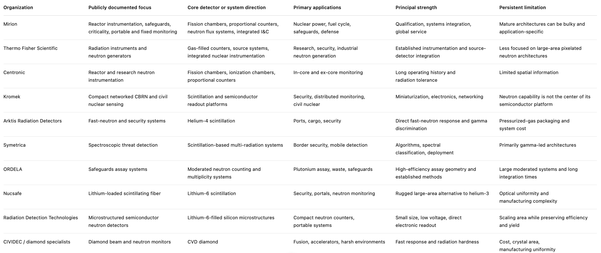
</p>

---

### 4.2 Research Institutions Driving Detector Innovation

National laboratories and scientific facilities remain the primary engines of fundamental neutron detector innovation. Their role differs from that of commercial manufacturers. Rather than optimizing for near-term product qualification, they develop materials, fabricate prototypes, operate irradiation facilities, benchmark response functions, and create instruments for count rates, spatial resolutions, or radiation environments that are not yet commercially routine.

Los Alamos National Laboratory occupies a central position because neutron measurement is tied directly to nuclear data, stockpile stewardship, safeguards, and high-energy neutron science. LANSCE provides neutron beams extending from moderated energies into hundreds of MeV, enabling detector characterization, nuclear-data measurements, and radiation-effects testing. LANL has also developed advanced neutron multiplicity methods, segmented detectors, fast-neutron instrumentation, and digital analysis techniques for national-security missions.

Lawrence Livermore National Laboratory is a major center for high-energy-density neutron diagnostics through the National Ignition Facility. Its programs have advanced neutron time-of-flight systems, activation diagnostics, neutron imaging, recoil-based spectroscopy, and high-dynamic-range yield measurement. These instruments are not ordinary detectors; they are coordinated diagnostic architectures that reconstruct implosion performance from multiple independent neutron signatures.

Oak Ridge National Laboratory combines two roles. Through the Spallation Neutron Source and High Flux Isotope Reactor, it operates one of the world’s largest neutron-scattering and imaging infrastructures. It is also developing the next generation of instrument detectors, readout systems, and data pipelines required for energy-resolved imaging, diffraction, and spectroscopy. ORNL’s imaging program includes MARS and the VENUS beamline, with applications ranging from batteries and additive manufacturing to nuclear materials and time-dependent fluid transport.

NIST has become especially important in high-resolution digital neutron imaging. Its detector suite includes lens-coupled scintillator cameras, amorphous-silicon flat panels, and boron- or gadolinium-doped microchannel-plate systems. The NIST systems demonstrate the current trade space clearly: large cameras can provide tens to hundreds of megapixels, while MCP detectors provide event-mode operation, high count-rate capability, and timing on the order of 100 ns over smaller active areas.

Idaho National Laboratory is central to reactor instrumentation because it operates irradiation and test-reactor infrastructure used to qualify fuels, materials, and sensors under representative reactor conditions. Its Advanced Test Reactor provides very high thermal and fast neutron fluxes across multiple experimental positions, making it an important environment for testing in-core instrumentation, radiation-hard electronics, and high-temperature sensor technologies.

In Europe, the European Spallation Source has been one of the strongest forces behind helium-3 replacement and high-rate large-area detector development. ESS requirements exposed the limits of traditional helium-3 tubes in count rate, spatial resolution, cost, and supply. This led to major investment in boron-10-based architectures such as Multi-Grid and Multi-Blade detectors, as well as multilayer GEM systems such as CASCADE.

The Institut Laue-Langevin, ISIS, CERN n_TOF, J-PARC, and the China Spallation Neutron Source play similar roles within their respective specialties. Their detectors are shaped by facility architecture: reflectometry favors high local rate and fine position resolution, diffraction demands large angular coverage, spectroscopy demands precise time stamping, and nuclear-data measurements often require fission chambers, proton-recoil telescopes, or track-reconstructing detectors with tightly controlled systematic uncertainty. The fissionTPC collaboration, for example, replaced simple counting with full charged-particle track reconstruction to reduce uncertainties in neutron-induced fission measurements.

<p align="center" width="100%">
    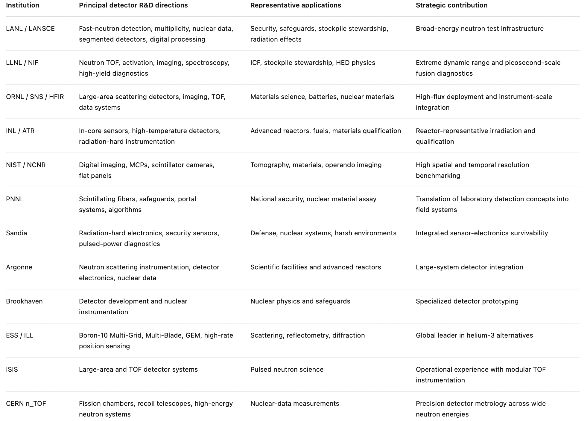
</p>

---

### 4.3 Fusion Diagnostics Programs

Fusion is one of the strongest drivers of next-generation neutron instrumentation because the neutron measurement is simultaneously a physics diagnostic, a performance metric, and eventually an operational signal. The most advanced public diagnostic architectures are found at ITER, JET, NIF, and OMEGA. Private fusion companies are increasingly important, but their detailed neutron diagnostic stacks are rarely published. Assigning specific detector systems to those firms without technical documentation would therefore be speculative.

ITER provides the clearest published example of a systems-level neutron diagnostic architecture. Its radial neutron camera is designed around 26 collimated lines of sight and must reconstruct the neutron emissivity profile in real time with a 10 ms control cycle. The planned acquisition system must process neutron spectra, discriminate neutron and gamma events, reject pileup, and handle peak rates of approximately two million events per second per line of sight.  The camera is only one part of a larger suite that includes fission chambers, activation systems, neutron flux monitors, and spectrometers. Calibration itself is a systems challenge, requiring embedded references, cross-calibration, transport modeling, and tracking across the machine lifetime.

JET established many of the operational precedents for real-time neutron diagnostics in magnetic-confinement fusion. Its instruments helped demonstrate that neutron measurement could move from post-shot interpretation into real-time plasma control and feedback.  JT-60SA and SPARC are expected to continue this trajectory, although detailed public disclosures of SPARC’s final neutron diagnostic architecture remain limited.

In inertial confinement, NIF and OMEGA operate under different constraints. Burn durations are extremely short, neutron yields span wide dynamic ranges, and line-of-sight diagnostics must separate primary neutrons from down-scattered populations. The resulting systems rely on combinations of neutron time-of-flight detectors, activation diagnostics, spectrometers, and imaging methods rather than one instrument. Diamond has received particular attention because it combines fast response, low leakage current, gamma tolerance, and improved radiation hardness relative to conventional silicon. Diamond proton-recoil telescopes and thin CVD diamond sandwich detectors have demonstrated 14 MeV neutron measurement with promising energy resolution, but their active area, efficiency, cost, and radiation lifetime remain limiting factors.

Commercial fusion developers are likely to create a second stage of demand that differs from research facilities. Experimental machines can justify highly customized diagnostics maintained by expert teams. Commercial reactors will require reproducible, calibrated, remotely serviceable instruments that can function as part of reactor controls. Interviews conducted for this review reinforce several recurring needs: distributed measurement points, absolute yield, high dynamic range, time-resolved spectral data, spatial reconstruction, calibration stability, and lower-cost arrays. The gap between a scientific diagnostic and a commercial reactor sensor may therefore become one of the largest opportunities in the field.

<p align="center" width="100%">
    
</p>

The absence of public disclosure is itself noteworthy. It suggests that neutron diagnostics are increasingly being treated as part of the competitive reactor architecture rather than as generic laboratory instrumentation.

---

### 4.4 Advanced Reactor Instrumentation

Advanced fission developers largely retain the proven detector families of conventional nuclear power: fission chambers, ionization chambers, self-powered neutron detectors, ex-core monitors, and startup-range proportional counters. Their innovation is occurring less in the interaction physics than in sensor placement, digital acquisition, autonomous control, high-temperature survivability, and integration with compact reactor geometry.

Conventional reactors use self-powered neutron detectors and fission chambers because they are simple, stable, and compatible with high gamma fields. SPNDs provide a direct current proportional to neutron flux and remain widely used for in-core flux mapping.  Advanced reactors complicate this model. Sodium, molten salt, helium, lead, and microreactor designs impose different temperatures, access constraints, moderator conditions, and neutron spectra. A detector qualified for a pressurized-water reactor cannot automatically be transferred into a fast-spectrum or high-temperature system.

INL and other reactor programs are therefore investing in high-temperature sensors, silicon-carbide devices, diamond detectors, radiation-hard electronics, and digital instrumentation. SiC is particularly attractive because its wide bandgap supports elevated-temperature operation and low leakage current, while its mechanical and radiation properties fit advanced-reactor environments. However, converter integration, defect control, charge collection, and long-term stability remain active research problems.

The commercial opportunity may be strongest in distributed reactor sensing. Conventional systems often reconstruct core behavior from a modest number of point detectors and validated models. Smaller reactors create the possibility of denser coverage, three-dimensional flux reconstruction, and direct integration with digital twins. Interviews with Radiant engineers, for example, indicated current reliance on three fission chambers and interest in a three-dimensional representation of neutron activity. This does not imply that imaging is required for safe reactor operation. It suggests that richer spatial information could accelerate design validation, startup testing, anomaly detection, and autonomous control.

Public information from Kairos, TerraPower, Oklo, X-energy, NuScale, and Westinghouse generally describes plant-level instrumentation and licensing strategy rather than detector-level architecture.

---

### 4.5 Defense, Safeguards, and Nuclear Security

Defense and safeguards have historically been among the largest institutional drivers of neutron detector development. The core problem is difficult: special nuclear material may emit very few neutrons, shielding can alter the spectrum, gamma backgrounds can be intense, and false alarms impose operational costs. The resulting systems optimize absolute efficiency, gamma rejection, moderation geometry, coincidence timing, and field reliability rather than high spatial resolution.

The helium-3 shortage fundamentally redirected this field. Helium-3 had been the preferred material for moderated thermal-neutron portals and assay systems, but declining supply and post-2001 security demand made large-scale deployment unsustainable. This created investment in boron-10-lined tubes, lithium-6 scintillators, scintillating fibers, boron-coated GEMs, helium-4 fast-neutron detectors, and microstructured semiconductor devices. ESS research independently reached a similar conclusion for scientific instruments: helium-3 remained technically strong, but supply, cost, rate capability, and spatial-resolution requirements justified alternative architectures.

Safeguards also continue to rely heavily on multiplicity counting, coincidence systems, and moderated geometries because these methods provide information about fissile mass and neutron multiplication, not merely radiation presence. The most important innovation may therefore come from combining improved detectors with better inference. Segmented arrays, digital pulse processing, list-mode acquisition, machine-learning classification, and transport-based reconstruction can extract more information from the same number of detected events.

Commercial security systems are also moving toward distributed networks. Kromek’s publicly documented portfolio includes handheld instruments, static nodes, UAV-mounted platforms, and networked CBRN systems, illustrating the broader transition from isolated survey meters toward connected sensing architectures.  For defense and border applications, this shift places equal importance on low power, communications, calibration, cybersecurity, and automated alarm logic.

---

### 4.6 Scientific Neutron Facilities

Scientific facilities are the most demanding customers for large-area, position-sensitive, and time-resolved thermal-neutron detectors. Their requirements are set by instrument geometry rather than by generic radiation monitoring. A reflectometer may need extreme local count rate and submillimeter position resolution. A diffractometer may need square meters of coverage. A time-of-flight spectrometer may need nanosecond-level timing over thousands of channels.

ESS has become the defining example. Its instrument suite required new detector technologies because standard helium-3 tubes could not simultaneously satisfy the required area, rate, resolution, and cost. The Multi-Grid architecture uses boron-10-coated blades for large-area detection, while Multi-Blade targets high-rate reflectometry. CASCADE uses multilayer boron-coated GEM foils to combine high rate, two-dimensional position sensitivity, and precise time-of-flight response.

NIST illustrates the parallel development of digital imaging. Its current suite spans large-format optical cameras, flat panels, and event-mode MCPs. The systems expose a persistent tradeoff: increasing field of view generally reduces effective spatial resolution, while high-resolution event-counting detectors remain smaller and more expensive.  ORNL’s MARS and VENUS instruments push toward multimodal and energy-selective imaging, creating demand for high-throughput data processing alongside improved detector hardware.

The scientific-facility market is small in unit volume but disproportionately important in technology development. It is often the first market willing to fund detector arrays with thousands of channels, custom ASICs, nonstandard materials, and complex calibration. Technologies proven there can later migrate into security, fusion, and industrial imaging.

---

### 4.7 Government Investment and Strategic Direction

Government investment in neutron detection is rarely organized under a single program. It is distributed across nuclear security, basic science, fusion, reactor development, space exploration, and defense. The funding pattern is therefore more informative when analyzed by mission.

DOE Office of Science investment supports neutron-scattering facilities, detector development for high-rate instruments, and data acquisition for SNS and partner facilities. DOE Nuclear Energy and INL support in-core sensors, reactor instrumentation, radiation-hard electronics, and advanced-reactor qualification. NNSA supports neutron diagnostics for stockpile stewardship, high-energy-density physics, multiplicity counting, and nuclear-data measurements. DTRA and DoD programs emphasize detection of shielded nuclear material, portable systems, active interrogation, and operation in contested environments. NASA funds compact neutron spectrometers and dosimeters for crew protection and planetary hydrogen mapping.

European funding has concentrated on ESS, Horizon programs, EURATOM fusion instrumentation, and distributed detector-development consortia. The boron-10 Multi-Grid and Multi-Blade programs are examples of mission-driven research that simultaneously addressed helium-3 scarcity and the performance demands of a new scientific facility.

Across agencies, the direction of investment has shifted from simple material substitution toward systems integration. The first wave after the helium-3 shortage asked whether boron, lithium, or helium-4 could reproduce thermal-neutron counting. The current wave asks whether detectors can provide higher rate capability, spatial information, digital networking, lower power, automated analysis, and reduced lifecycle cost.

---

### 4.8 Cross-Cutting Technology Trends

**Helium-3 replacement has evolved into performance-driven redesign**

The original motivation was supply. The present motivation is broader. Boron-10 grids, lithium-6 scintillators, GEMs, helium-4 scintillation, and semiconductor microstructures are now being optimized not only to replace helium-3, but to improve rate capability, geometry, manufacturability, and spatial resolution.

**Semiconductor detectors are moving from niche devices toward platform architectures**

Semiconductor neutron detectors promise direct electronic readout, low operating voltage, compact packaging, pixelation, and compatibility with integrated electronics. Microstructured devices increase converter-semiconductor interfacial area and can achieve substantially higher efficiency than planar coated diodes. Wide-bandgap devices such as SiC offer a path toward high-temperature and radiation-tolerant sensing. Their unresolved problems are large-area manufacturing, converter uniformity, charge trapping, radiation damage, cost, and efficient fast-neutron conversion.

**Diamond is becoming the extreme-environment semiconductor**

Diamond is unlikely to become the cheapest large-area detector, but it is increasingly important where timing, gamma rejection, temperature tolerance, and radiation hardness dominate. Fusion and accelerator applications are the clearest near-term markets.

**Pixelated and event-mode imaging is expanding**

Neutron imaging is shifting from film and integrating cameras toward digital flat panels, MCPs, event-counting systems, and energy-selective imaging. NIST’s imaging suite already spans 62–100 MP optical cameras, amorphous-silicon panels, and event-mode MCP detectors. The remaining gap is a detector that combines large active area, high efficiency, fine pixelation, high frame rate, and practical cost.

**Digital pulse processing is becoming part of the detector rather than an accessory**

ITER’s radial neutron camera illustrates the direction: digitization, pulse-shape discrimination, pileup rejection, compression, spectral processing, and emissivity inversion are treated as one integrated diagnostic system.

**Distributed sensing is replacing isolated instruments**

Fusion reactors, microreactors, border networks, and industrial facilities increasingly require many synchronized measurement points rather than one high-performance detector. This trend elevates manufacturing yield, calibration transfer, networking, low power, and self-diagnostics to the same level as intrinsic detection efficiency.

**AI and model-based reconstruction are becoming necessary at high channel count**

Large imaging systems already generate datasets that are difficult to process conventionally; NIST notes that reconstructed neutron and X-ray volumes can reach hundreds of gigabytes. As detector arrays scale, automated reconstruction, anomaly detection, compression, and calibration monitoring will become operational requirements rather than research conveniences.

---

### 4.9 Remaining Technology Gaps

Across the ecosystem, the same limitations recur despite major differences in application.

First, no widely deployed detector combines **high efficiency, large area, fine spatial resolution, energy resolution, fast timing, gamma discrimination, and radiation hardness.** Existing systems occupy different regions of that trade space.

Second, large-area digital neutron imaging remains constrained by the efficiency-resolution-area triangle. Thick scintillators improve neutron capture but blur the image. Fine pixels preserve spatial information but reduce signal. Event-counting MCPs provide excellent timing and resolution but remain expensive and area-limited.

Third, high-flux fast-neutron detection remains difficult. Fusion systems require detectors that preserve linearity and information content under intense flux, but pulse pileup, radiation damage, and electronics saturation limit many existing architectures.

Fourth, reactor-grade semiconductor detectors remain immature relative to gas-filled instrumentation. SiC and diamond have compelling material properties, but long-duration calibration stability, packaging, converter integration, fabrication yield, and licensing evidence remain insufficient for broad replacement of fission chambers and SPNDs.

Fifth, calibration is becoming a systems bottleneck. Distributed arrays are useful only if hundreds or thousands of channels maintain known sensitivity over time. ITER’s reliance on cross-calibration, embedded references, and transport modeling illustrates how difficult this becomes in inaccessible radiation environments.

Sixth, manufacturing remains underdeveloped. Many high-performance neutron detectors are still fabricated as custom instruments. The field lacks an equivalent to standardized semiconductor image-sensor foundries capable of producing large neutron-sensitive arrays with repeatable yield, integrated readout, and low cost.

---

### 4.10 Why the Ecosystem Motivates Next-Generation Semiconductor Detectors

The case for semiconductor neutron detectors does not rest on the claim that they will replace every gas detector, scintillator, or diamond sensor. That would contradict the application-specific framework established throughout this review. Their importance lies instead in the number of unresolved system-level requirements they could address simultaneously.

Semiconductor platforms are compatible with pixelated geometries, direct electronic readout, compact packaging, low-voltage operation, wafer-scale processing, ASIC integration, and distributed arrays. Microstructured geometries can increase thermal-neutron efficiency; wide-bandgap materials can extend operation into high-temperature and high-radiation environments; organic and polymer semiconductors may enable flexible, conformal, and large-area devices; and integrated electronics can move event classification and calibration closer to the detector.

The central opportunity is therefore not merely a more sensitive semiconductor neutron detector. It is a manufacturable neutron-sensing platform that can be adapted across applications by changing converter materials, device geometry, electronics, and software. In fusion, such a platform could support tiled spatial arrays. In advanced fission, it could enable distributed three-dimensional flux monitoring. In safeguards, it could provide compact, low-power networks. In imaging, it could move the field toward true digital neutron panels. In medicine and space, it could enable conformal or mass-constrained dosimetry.

The global ecosystem is already moving toward the attributes that semiconductor manufacturing has historically delivered in other sensing industries: integration, pixelation, miniaturization, reproducibility, and scale. The open question is whether neutron-sensitive materials and architectures can reach the efficiency, durability, and calibration stability required to realize that promise.

---

## 5) Network Map

<p align="center" width="100%">
    
</p>
<p align="center"><em>For access to this graph, reach out to lphilip@engineering.upenn.edu</em></p>

---

## 6) Resources & Notes

Below is a curated collection of papers, technical reports, facility documentation, and industry publications that capture the physics, applications, technological evolution, and emerging commercial landscape of neutron detection.

---

### **Neutron Detection Fundamentals & Reference Works**
- **Los Alamos National Laboratory — Neutron Detection Capabilities**: [technical overview](https://www.lanl.gov/media/news/0330-neutron-detection-capabilities)
- **ORNL — Detectors for Slow Neutrons**: [lecture notes](https://neutrons2.ornl.gov/nxs/2014/lectures/resources/carpenter--detectors-for-slow-neutrons.pdf)
- **IAEA-TECDOC-973 — Research Reactor Instrumentation and Control Technology**: [report](https://www-pub.iaea.org/MTCD/Publications/PDF/te_973_prn.pdf)
- **IAEA Nuclear Verification Series No. 1**: [handbook](https://www-pub.iaea.org/MTCD/Publications/PDF/nvs1_web.pdf)
- **IAEA-TECDOC-1935 — Development of New Neutron Detection Technologies**: [report](https://www-pub.iaea.org/MTCD/Publications/PDF/TE-1935_web.pdf)

### **Helium-3 Replacement & Boron-Based Detectors**
- **Multi-Grid Boron-10 Detector for Large-Area Neutron Scattering Applications**: [paper](https://arxiv.org/abs/1209.0566)
- **Boron-10 Layers, Neutron Reflectometry and Thermal-Neutron Gaseous Detectors**: [paper](https://arxiv.org/abs/1406.3133)
- **Novel Boron-10-Based Detectors for Neutron Scattering Science**: [paper](https://arxiv.org/abs/1501.05201)
- **CASCADE — A Multilayer Boron-10 Neutron Detection System**: [paper](https://arxiv.org/abs/1602.04064)
- **The Multi-Blade Boron-10-Based Neutron Detector for High-Intensity Neutron Reflectometry at ESS**: [paper](https://arxiv.org/abs/1701.07623)
- **Characterization of the Multi-Blade Detector at the ISIS CRISP Reflectometer**: [paper](https://arxiv.org/abs/1803.09589)
- **Neutron Reflectometry with the Multi-Blade Boron-10-Based Detector**: [paper](https://arxiv.org/abs/1804.03962)
- **Multi-Blade Performance with a Focusing Reflectometer**: [paper](https://arxiv.org/abs/2001.02965)
- **Time- and Energy-Resolved Effects in Boron-10 Multi-Grid and Helium-3 Thermal-Neutron Detectors**: [paper](https://arxiv.org/abs/2006.01484)

### **Semiconductor & Solid-State Neutron Detectors**
- **Characterization of the Silicon and Lithium-6 Fluoride Thermal-Neutron Detection Technique**: [paper](https://arxiv.org/abs/1506.02302)
- **Study of Silicon and Lithium-6 Fluoride Thermal-Neutron Detectors: GEANT4 Simulations versus Real Data**: [paper](https://arxiv.org/abs/1703.01992)
- **A Semiconductor-Based Neutron Detection System for Planetary Exploration**: [paper](https://arxiv.org/abs/1906.01137)
- **Silicon Carbide Diodes for Neutron Detection**: [review](https://arxiv.org/abs/2009.14696)
- **Scalable Organic Semiconductor Neutron Detectors**: [paper](https://arxiv.org/abs/2212.08438)
- **Direct Neutron Detectors Based on Carborane-Containing Conjugated Polymers**: [paper](https://arxiv.org/abs/2511.14561)
  
### **Diamond Detectors & Extreme Environments**
- **Development of Single-Crystal Diamond Neutron Detectors and Testing at JET**: [paper](https://doi.org/10.1016/j.nima.2008.07.125)
- **High-Temperature Response of a Single-Crystal CVD Diamond Detector**: [paper](https://doi.org/10.1016/j.nima.2019.162493)
- **Properties of Diamond-Based Neutron Detectors Operated in Harsh Environments**: [review](https://doi.org/10.3390/jne2030026)
- **Assessment of Single-Crystal Diamond Detector Radiation Hardness to 14 MeV Neutrons**: [paper](https://doi.org/10.1016/j.nima.2021.165574)
- **Diamond Detector Characterization under Wide-Energy-Spectrum Neutrons**: [paper](https://doi.org/10.1016/j.diamond.2024.111112)
- **Recent Advances in Diamond Radiation Detectors for Extreme Environments**: [review chapter](https://www.intechopen.com/online-first/1228610)

### **Particle-Physics Readout & Precision Neutron Measurements**
- **A Time Projection Chamber for High-Accuracy Fission Cross-Section Measurements**: [paper](https://arxiv.org/abs/1403.6771)
- **Uranium-238 to Uranium-235 Fission Cross-Section Measurements with the fissionTPC**: [paper](https://arxiv.org/abs/1802.08721)
- **Hydrogen Elastic Scattering as a Cross-Section Reference with the fissionTPC**: [paper](https://arxiv.org/abs/1904.10558)
- **Fission Fragment Tracking with the NIFFTE Fission Time Projection Chamber**: [paper](https://arxiv.org/abs/2001.09381)
- **Particle-Physics Readout Electronics and Novel Detector Technologies for Neutron Science**: [paper](https://arxiv.org/abs/2207.06470)

### **Fusion Neutron Diagnostics**
- **D-D and D-T Fusion Reaction Fundamentals**: [reference page](http://hyperphysics.phy-astr.gsu.edu/hbase/NucEne/fusion.html)
- **Proton-Recoil Telescope Based on Diamond Detectors for Fusion Neutrons**: [paper](https://arxiv.org/abs/1505.06316)
- **Real-Time Data Compression for the ITER Radial Neutron Camera**: [paper](https://arxiv.org/abs/1806.04671)
- **FPGA Acquisition and Real-Time Processing for the ITER Radial Neutron Camera**: [paper](https://arxiv.org/abs/1806.06150)
- **Real-Time Software Architecture for the ITER Radial Neutron Camera**: [paper](https://arxiv.org/abs/1806.08637)
- **Review of Neutron Diagnostics for Fusion Plasmas**: [review](https://www.sciencedirect.com/science/article/pii/S0370157320302490)
- **Progress of Design and Development for the ITER Radial Neutron Camera**: [paper](https://link.springer.com/article/10.1007/s10894-022-00333-9)
- **ITER — Counting Neutrons to Measure Fusion Power**: [facility article](https://www.iter.org/node/20687/counting-neutrons-measure-fusion-power)
- **Fusion for Energy — A Camera to Observe ITER Neutrons**: [facility article](https://fusionforenergy.europa.eu/news/a-camera-to-see-iter-neutrons/)
- **Helion — Measuring Fusion Reactions with Neutron Diagnostics**: [technical article](https://www.helionenergy.com/blog/measuring-fusion-reactions-neutron-diagnostics)
- **Helion — How We Conducted and Measured Deuterium-Tritium Fusion**: [technical article](https://www.helionenergy.com/blog/how-we-conducted-and-measured-d-t-fusion)
  
### **Nuclear Safeguards, Multiplicity Counting & Special Nuclear Materials**
- **Los Alamos National Laboratory — Introduction to Neutron Multiplicity Counting**: [technical report](https://cdn.lanl.gov/files/m-app-to-neutron-multiplicity-counting_9ea55.pdf)
- **Measured Nondestructive Assay of Neptunium-237 Using Organic Scintillators and Active Neutron Multiplicity Counting**: [paper](https://arxiv.org/abs/2010.06587)
- **Multiplicity Counting Using Organic Scintillators to Distinguish Neutron Sources**: [paper](https://arxiv.org/abs/2308.06282)
  
### **Digital Neutron Imaging & Non-Destructive Testing**
- **IAEA-TECDOC-1223 — Neutron Radiography and Imaging Applications**: [report](https://www-pub.iaea.org/MTCD/Publications/PDF/te_1223_prn.pdf)
- **Oak Ridge National Laboratory — Neutron Imaging Instrument Suite**: [facility page](https://neutrons.ornl.gov/suites/imaging)
- **NIST — Neutron Imaging Detector Suite**: [facility page](https://www.nist.gov/laboratories/tools-instruments/neutron-imaging-detector-suite)
  
### **Scientific Neutron Facilities & Large-Area Detector Systems**
- **European Spallation Source**: [facility](https://www.ess.eu/)
- **Spallation Neutron Source at Oak Ridge National Laboratory**: [facility](https://neutrons.ornl.gov/sns)
- **High Flux Isotope Reactor at Oak Ridge National Laboratory**: [facility](https://neutrons.ornl.gov/hfir)
- **Institut Laue-Langevin**: [facility](https://www.ill.eu/)
- **ISIS Neutron and Muon Source**: [facility](https://www.isis.stfc.ac.uk/)
- **CERN Neutron Time-of-Flight Facility**: [facility](https://home.cern/science/experiments/ntof)

### **Advanced Reactors & Digital Instrumentation**
- **Idaho National Laboratory — Advanced Test Reactor**: [facility](https://inl.gov/trending-topics/advanced-test-reactor/)
- **U.S. Department of Energy — Advanced Reactor Demonstration Program**: [program](https://www.energy.gov/ne/advanced-reactor-demonstration-program)
- **U.S. Nuclear Regulatory Commission — Advanced Reactors**: [regulatory resource](https://www.nrc.gov/reactors/new-reactors/advanced.html)
  
### **Space, Planetary Science & Crew Radiation Monitoring**
- **NASA Mars Odyssey — Neutron Spectrometer and Gamma-Ray Spectrometer Suite**: [mission page](https://science.nasa.gov/mission/odyssey/science-instruments/)
- **NASA Technical Report — Neutron Detection for Space Applications**: [report](https://ntrs.nasa.gov/citations/20170010372)
- **NASA — Fast Neutron Spectrometer for Future Human Spaceflight**: [technical article](https://www.nasa.gov/missions/station/nasas-new-spectrometer-to-help-future-crews-cope-with-cosmic-radiation/)

### **Government, Security & International Programs**
- **U.S. Department of Energy Office of Science — Neutron Scattering Facilities**: [program](https://science.osti.gov/bes/suf/User-Facilities/Neutron-Scattering-Facilities)
- **National Nuclear Security Administration — Nonproliferation**: [program](https://www.energy.gov/nnsa/nonproliferation)
- **Defense Threat Reduction Agency**: [agency](https://www.dtra.mil/)
- **International Atomic Energy Agency — Nuclear Safeguards**: [program](https://www.iaea.org/topics/safeguards)
- **EURATOM Research and Training Programme**: [program](https://research-and-innovation.ec.europa.eu/funding/funding-opportunities/funding-programmes-and-open-calls/horizon-europe/euratom-research-and-training-programme_en)

### **Internal Interview Notes & Market Research**

The following discussions informed the application requirements, market analysis, and industry perspectives developed throughout Sections 2–4.

- **Commercial fusion diagnostics:** Xcimer Energy, Commonwealth Fusion Systems, Realta Fusion, Pacific Fusion, Thea Energy, SHINE Technologies, Helion Energy, and the Fusion Industry Association
- **Inertial-confinement fusion:** Laboratory for Laser Energetics and the OMEGA Laser Facility
- **Advanced fission and microreactors:** Radiant Nuclear and Purdue University PUR-1 reactor personnel
- **Industrial neutron imaging:** SHINE Technologies and Phoenix Neutron Imaging
- **Nuclear security and defense:** Defense Threat Reduction Agency, U.S. Department of Defense, and U.S. Navy stakeholders
- **Government and national-laboratory ecosystem:** U.S. Department of Energy and national-laboratory researchers

---
